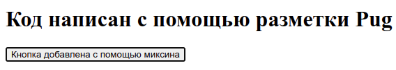
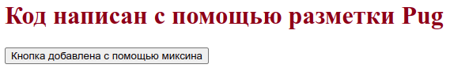
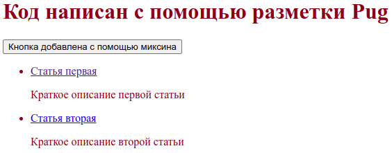

## О чем статья

В статье показано, как настроить собственную сборку из модулей NPM, которая является полным аналогом сборки [npm-for-frontend](https://github.com/injashkin/npm-for-frontend). Эта сборка позволит создавать статические страницы сайта, а именно:

- Создавать разметку с помощью шаблонизатора Pug.
- Стилизовать страницы с помощью препроцессора Sass.
- Наполнять содержимое страниц сайта с помощью разметки Markdown.
- Добавлять картинки, значки, шрифты.
- Добавлять интерактив на сайт используя самые последние достижения языка JavaScript и при этом не переживать, что какая-то новая функция не будет распознана старым браузером.

Сама сборка будет выполнять следующие функции:

- Автоматически преобразовывать Pug разметку и разметку Markdown в понятный для браузеров HTML
- Автоматически преобразовывать Sass стили и объединять их в один файл `index.css`.
- Все скрипты будут транспилированы и упакованы в один файл `index.js`.
- Автоматически оптимизировать картинки, значки, шрифты для увеличения быстродействия готового сайта.

## Быстрый запуск проекта

Чтобы выполнять дальнейшие действия у нас на компьютере должен быть установлен [Node.js](https://nodejs.org/) и NPM.

Откроем терминал и создадим каталог `my-project` нашего будущего проекта, и сразу перейдем в него:

```
mkdir my-project
cd my-project
```

Теперь, если нам нужна система контроля версий Git, то выполним два простых шага, сначала, инициализируем Git:

```
git init
```

Затем создадим файл `.gitignore`:

```
touch .gitignore
```

В этом файле будем указывать игнорируемые файлы и каталоги, которые не должны попадать в коммиты. Если файл `.gitignore` не виден в каталоге, то нужно нажать сочетание клавиш `Ctrl+H`. Запишем в файле `.gitignore` следующее:

```
node_modules
```

С настройками Git в этом проекте покончено. Теперь не забываем, хотя бы иногда, делать коммиты.

Инициализируем npm. Для этого введем в терминале команду:

```
npm init -y
```

Будет создан файл `package.json` с настройками по умолчанию (опция -y). Наиболее полную информацию о файле package.json можно прочитать в [документации по npm](https://docs.npmjs.com/cli/v8/configuring-npm/package-json).

## Подключение и настройка шаблонизатора Pug

В настоящее время мало кто верстает на чистом HTML. Придуманы более удобные для написания языки и инструменты, которые эти языки преобразуют в HTML. Одним из таких инструментов является [шаблонизатор Pug](https://pugjs.org/), который имеет свой, более удобный синтаксис для написания разметки. После компиляции синтаксис Pug превращается в разметку HTML.

Установим pug. Для этого введем в терминале команду:

```
npm i -D pug-cli
```

Вместо опции `i` можно написать `install`. Опция `-D` указывает, что устанавливаемый пакет нужен только для разработки и не будет использоваться в производственной сборке. Поэтому, устанавливаемый пакет будет прописан в секции `"devDependencies": {...}` файла `package.json`.

В результате, в корневом каталоге проекта будет создан каталог `node_modules` и файл `package-lock.json`. Каталог `node_modules` содержит все установленные зависимости проекта. Обычно этот каталог не рекомендуется включать в репозитории, что мы и сделали, проигнорировав его в файле `.gitignore`. Файл `package-lock.json` хранит записи о точных версиях установленных зависимостей.

Создадим в корне проекта каталог `src`, в котором создадим каталог `pages`, в нем создадим каталог `home`, а уже в нем создадим файл `index.pug` со следующим содержимым:

**src/pages/home/index.pug**

```pug
h1.name= 'Код написан с помощью разметки Pug!'
```

Сохраним файл.

Создание каталогов здесь и далее может быть произвольным, но исходя из опыта лучше сразу придерживаться определенной структуры, чтобы потом мучительно не переделывать проект.

Настроим Pug для работы. Для этого добавим в секцию `"scripts"` файла `package.json` скрипт с именем `"pug"` (знак плюс `+` дальше по тексту будет лишь указывать на добавленные строки кода):

```json
{
  "name": "my-project",
  "version": "1.0.0",
  "description": "",
  "main": "index.js",
  "scripts": {
+   "pug": "pug --pretty -w src/pages/home/index.pug -o dist",
    "test": "echo \"Error: no test specified\" && exit 1"
  },
  "keywords": [],
  "author": "",
  "license": "ISC",
  "devDependencies": {
    "pug-cli": "^1.0.0-alpha6"
  }
}
```

- Опция `--pretty` (или `-P`) отключает минификацию, что дает на выходе красиво оформленную разметку HTML. По умолчанию, pug переводит код в минимизированный HTML, из которого вырезаны пробелы между тегами, табуляция и перевод строк.
- Ключ `-w` (или `--watch`) заставляет Pug следить за изменениями в файлах с расширениями `.pug` и как только мы сохраняем измененный файл, то Pug сразу перекомпилирует исходники.
- Путь `src/pages/home/index.pug` указывает на входной файл. Этот файл после компиляции будет на выходе с расширением `.html`. Если мы укажем каталог, то все файлы с расширением `.pug` этого каталога появятся на выходе с расширением `.html`, что не всегда бывает нужно.
- Ключ `-o` (или `--out`) указывает, что откомпилированные файлы будут выводится в другой каталог. Этот каталог нужно указать сразу после ключа, в нашем случае это каталог `dist`. Если такого каталога не существует, он будет создан.
- `dist` - это каталог, в который будут компилироваться файлы. Можно указать имя конкретного файла, который должен получится на выходе, например, `dist/index.html`. Тогда ключ `-o` следует опустить, иначе имя файла будет воспринято как имя каталога. К тому же, все каталоги, указанные в пути должны существовать, так как без ключа `-o` каталоги не создаются.

Более подробно об опциях командной строки можно узнать в [репозитории pug-cli](https://github.com/pugjs/pug-cli)

После установки и конфигурации шаблонизатора Pug проверим его в работе. Из корневого каталога проекта запустим в терминале команду:

```
npm run pug
```

Будет создан каталог `dist`, а в нем файл `index.html`. Если мы откроем этот файл в браузере, то увидим следующее:

```
Код написан с помощью разметки Pug!
```

Если мы откроем файл `dist/index.html` в редакторе кода то увидим откомпилированную HTML разметку:

```html
<h1 class="name">Код написан с помощью разметки Pug</h1>
```

Чтобы данный файл был полноценной HTML страницей и без ошибок проходил [валидатор](https://validator.w3.org/#validate_by_upload) в файл нужно добавить теги `<!DOCTYPE html>`, `<html>`, `<head>`, `<body>` и некоторые теги `<meta>`. Данные теги должны присутствовать на каждой HTML странице.

Чтобы не повторять во всех шаблонах Pug одинаковый код, создадим общий шаблон, который будет применятся ко всем страницам нашего сайта. Для этого в каталоге `src` создадим каталог `layouts`, внутри которого создадим каталог `base`, а в нем файл `index.pug` со следующим содержимым:

**src/layouts/base/index.pug**

```pug
-
  let data = {
    default_description: "Показан пример общего шаблона Pug для всех страниц",
    default_title: "Общий шаблон Pug"
  }

- const {default_title, default_description} = data

doctype html
html(lang='ru')
  head
    meta(charset='utf-8')
    meta(name='viewport' content='width=device-width, initial-scale=1.0')

    meta(name= 'description' content= description ? description : default_description)
    title= title ? title : default_title

  body
    block main
```

Содержимое файла `src/pages/home/index.pug` изменим на следующее:

```pug
extends ../../layouts/base/index

block main
  h1.name= 'Код написан с помощью разметки Pug!'
```

Теперь, если мы откроем файл `dist/index.html` в редакторе кода, мы увидим следующую разметку:

```html
<!DOCTYPE html>
<html lang="ru">
  <head>
    <meta charset="utf-8" />
    <meta name="viewport" content="width=device-width, initial-scale=1.0" />
    <meta
      name="description"
      content="Показан пример общего шаблона Pug для всех страниц"
    />
    <title>Общий шаблон Pug</title>
  </head>
  <body>
    <h1 class="name">Код написан с помощью разметки Pug!</h1>
  </body>
</html>
```

Если мы этого не увидим, значит мы либо закрыли окно терминала с выполняемым компилятором Pug, либо что-то сделали неправильно.

Проверка данного файла в [валидаторе](https://validator.w3.org/#validate_by_upload) не выявит никаких ошибок.

Далее, мы создадим простую кнопку и добавим ее на страницу сайта. Реализуем кнопку с помощью миксина. Для этого создадим в каталоге `src` каталог `components`, в котором создадим каталог `button`, а в нем файл `button.pug` со следующим содержимым:

```pug
mixin button
  button.button= 'Кнопка добавлена с помощью миксина'
```

Не забываем сохранить файл.

В файл `src/pages/home/index.pug` подключим файл `button.pug` с помощью `include` и вызовем в нужном месте как миксин `+button()`:

```pug
extends ../../layouts/base/index
include ../../components/button/button.pug

block main
  h1.name= 'Код написан с помощью разметки Pug!'
  +button
```

После сохранения файла перезагрузим страницу браузера и мы увидим заголовок, а под ним кнопку:



## Настройка локального сервера BrowserSync

После очередного изменения кода, чтобы увидеть откомпилированный результат, нужно каждый раз вручную обновлять страницу браузера. Это очень быстро надоедает. Для того, чтобы после сохранения редактируемого файла браузер автоматически обновлял страницу можно использовать локальный сервер, такой как [BrowserSync](https://browsersync.io/docs/command-line) или [Pug Server](https://github.com/ctrlaltdev/pug-server). Мы будем использовать сервер BrowserSync, установим его. Для этого откроем новое окно терминала, так как в первом окне у нас запущен Pug, который работает в режиме наблюдения за файлами, и, сделав рабочим корневой каталог проекта, введем следующую команду:

```
npm i -D browser-sync
```

Добавим в файл `package.json` настройку, отмеченную знаком `+`:

```json
  "scripts": {
    "pug": "pug --pretty -w src/pages/home/index.pug -o dist",
+   "serve": "browser-sync dist -w",
    "test": "echo \"Error: no test specified\" && exit 1"
  },
```

Данный скрипт будет запускать сервер, а сервер будет наблюдать за всеми файлами в каталоге `dist`. Скрипт работает в browser-sync версии 2.23.0 и выше. Аналог данного скрипта, который будет работать в browser-sync любой версии приведен ниже:

```json
  "scripts": {
    ...
    "serve": "browser-sync start -s dist -f dist"
  },
```

Теперь в окне терминала выполним команду:

```
npm run serve
```

В результате, откроется браузер, в котором мы увидим нашу страницу.

Теперь, каждый раз, когда в каталоге `dist` происходят какие-либо изменения сервер будет автоматически обновлять браузер.

## Последовательный и параллельный запуск скриптов с помощью npm-run-all

Мы видим один неприятный момент. Для того, чтобы запустить шаблонизатор Pug в режиме наблюдения мы должны открыть окно терминала и выполнить команду `npm run pug`, затем, чтобы запустить сервер, нужно открыть другое окно терминала и выполнить `npm run serve`. И так нужно поступать каждый раз, когда начинаете процесс разработки. В дальнейшем, нам понадобится запускать в режиме наблюдения препроцессор Sass, постпроцессор Postcss, компилятор Babel и др. Если на каждую такую задачу открывать окно терминала и запускать команду типа `npm run *`, то это будет рутина.

Чтобы упростить процесс одновременного запуска нескольких npm-скриптов можно воспользоваться пакетами [concurrently](https://www.npmjs.com/package/concurrently) или [npm-run-all](https://github.com/mysticatea/npm-run-all). Здесь мы воспользуемся инструментом `npm-run-all`. Сначала установим его. Для этого откроем третье окно терминала и сделав рабочим корневой каталог проекта выполним следующую команду:

```
npm i -D npm-run-all
```

Затем отредактируем файл `package.json`:

```json
  "scripts": {
+   "watch:pug": "pug --pretty -w src/pages/home/index.pug -o dist",
+   "watch:serve": "browser-sync dist -w",
+   "dev": "npm-run-all -p watch:*",
    "test": "echo \"Error: no test specified\" && exit 1"
  },
```

Сохраним файл `package.json`.

Мы добавили скрипт `"dev": "npm-run-all -p watch:*"`, в котором опция `-p` (или `--parallel`) указывает на параллельное выполнение скриптов, следующих за этой опцией. У нас за этой опцией следует шаблон `watch:*`. Это значит, что параллельно будут выполнятся все скрипты, у которых в названии есть `watch:`. Поэтому, мы изменили имена скриптов: имя `"pug"` заменили на `"watch:pug"`; имя `"serve"` заменили на `"watch:serve"`.

Более подробно об опциях командной строки можно узнать из [документации инструмента npm-run-all](https://github.com/mysticatea/npm-run-all/blob/master/docs/npm-run-all.md)

Теперь, закроем все окна терминала кроме одного последнего и запустим следующую команду:

```
npm run dev
```

Мы увидим, что откроется браузер со страницей нашего сайта. И для этого нам понадобилось одно окно терминала и всего одна команда.

Возможно, кто-то скажет, что в NPM есть операторы `&` и `&&`, с помощью которых можно выполнить все тоже самое. Но оператор `&` не работает в Windows `cmd.exe`, а `npm-run-all -p` там отлично работает.

## Установка и настройка rimraf для очистки каталогов

Перед началом компиляции полезно будет очищать каталог `dist` от предыдущих файлов. Для этого будем использовать пакет `rimraf`, который является аналогом UNIX команды `rm -rf`, но работает в любой системе, которая поддерживает NPM. Установим этот пакет:

```
npm i -D rimraf
```

В файл `package.json` внесем правки:

```json
  "scripts": {
+   "clean": "rimraf dist",
+   "pug": "pug --pretty src/pages/home/index.pug -o dist",
    "watch:pug": "pug --pretty -w src/pages/home/index.pug -o dist",
    "watch:serve": "browser-sync dist -w",
+   "dev": "npm-run-all clean pug -p watch:*",
    "test": "echo \"Error: no test specified\" && exit 1"
  },
```

Мы создали скрипт `"clean"` для запуска rimraf и указали в скрипте `"dev"`, чтобы скрипт `"clean"` запускался самым первым. Так как скрипт `"clean"` удаляет каталог `dist`, то при параллельном запуске `pug` и `browser-sync` последний выдает ошибку. Поэтому, мы добавили дополнительный скрипт `"pug"` без режима наблюдения.

Закроем все окна терминала и откроем одно новое и сделав корневой каталог проекта рабочим выполним в терминале привычную нам команду:

```
npm run dev
```

`npm-run-all` выполнил сначала скрипт `"clean"`, потом скрипт `"pug'`, а после параллельно запустил два скрипта: `"watch:pug"` и `"watch:serve"`.

## Установка и настройка препроцессора node-sass и постпроцессора PostCSS с плагинами PostCSS Preset Env и cssnano

Для написания стилей мы будем использовать препроцессор [Sass](https://github.com/sass/node-sass#command-line-interface). Он позволяет нам использовать переменные, вложенности, миксины, наследование, математические операторы и др.

При написании стилей мы не хотим задумываться о префиксах, которые необходимы для корректной работы некоторых браузеров, а также, мы уже сегодня хотим использовать современный CSS не думая о его поддержке всеми браузерами. В этом нам поможет PostCSS с плагином [PostCSS Preset Env](https://github.com/csstools/postcss-plugins/tree/main/plugin-packs/postcss-preset-env). Этот плагин преобразует современный CSS в тот CSS, который понятен большинству браузеров, а также расставляет префиксы при необходимости.

Для производственной сборки важно минимизировать и сжать CSS, для более быстрой загрузки стилей. Поэтому, мы будем использовать плагин [cssnano](http://cssnano.co/), который сохраняя семантику удаляет ненужные пробелы и повторяющиеся правила, сжимает идентификаторы, убирает комментарии, удаляет устаревшие вендорные префиксы и выполняет много других оптимизаций.

Нам еще понадобится [postcss-cli](https://github.com/postcss/postcss-cli), чтобы запускать PostCSS из командной строки. Для начала установим все необходимые пакеты:

```
npm i -D node-sass postcss postcss-cli postcss-preset-env cssnano
```

Теперь приступим к написанию стилей. Создадим файл `./src/index.scss` и скопируем в него следующее:

```scss
$font-size: 1rem;
$font-color: lch(28 99 35);

html {
  font-size: $font-size;
  color: $font-color;
}

.example {
  user-select: none;
}
```

Добавим в файл `package.json` следующий код:

```json
  "scripts": {
+   "clean": "rimraf dist tmp",
    "pug": "pug --pretty src/pages/home/index.pug -o dist",
    "watch:pug": "pug --pretty -w src/pages/home/index.pug -o dist",
+   "sass": "node-sass src/index.scss -o tmp",
+   "watch:sass": "node-sass -w src/index.scss -o tmp",
+   "watch:post": "postcss -w tmp -d dist -u postcss-preset-env",
    "watch:serve": "browser-sync dist -w",
+   "dev": "npm-run-all clean pug sass -p watch:*",
    "test": "echo \"Error: no test specified\" && exit 1"
  },
```

Разберемся, что делают эти скрипты.

- `"clean": "rimraf dist tmp"`

`rimraf` удаляет каталоги `dist` и `tmp`.

- `"sass": "node-sass src/index.scss -o tmp"`

`node-sass` создает каталог `tmp` и однократно выполняет следующее - файл `src/index.scss` и подключенные к нему другие файлы `.scss` компилирует и помещает файл `tmp/index.css`.
Опция `-o` указывает, что скомпилированные файлы выводятся в каталог, который указывается после этой опции. Здесь этим каталогом является временный каталог `tmp`. Временный он потому, что после компиляции препроцессором файлы должны будут обработаны постпроцессором.

- `"watch:sass": "node-sass -w src/index.scss -o tmp"`

`node-sass` следит за файлом `src/index.scss` и каждый раз компилирует его при изменении содержимого, а полученный файл сохраняет в каталоге `tmp` с именем `index.css`.
Скрипт `"watch:sass"` не сильно отличается от скрипта `"sass"`. Разница в опции `-w`, которая запускает `node-sass` в режиме наблюдения. Если вызывать скрипт с опцией `-w`, то `node-sass` не сможет создать отсутствующий каталог. Поэтому сначала вызываем скрипт без опции `-w`, а потом с этой опцией.

- `"watch:post": "postcss -w tmp -d dist -u postcss-preset-env"`

`postcss` следит за каталогом `tmp` и если содержимое файлов в нем меняется, то файлы прогоняются через указанные плагины и помещаются в каталог `dist` с расширением `.css`
Опция `-u` указывает, какие плагины должен использовать `postcss` - здесь `postcss-preset-env`

- `"dev": "npm-run-all clean sass -p watch:*"`

`npm-run-all` запускает последовательно скрипт `clean` потом `sass`, затем запускает параллельно (`-p`) скрипты, у которых имя начинается на `watch:`

Теперь, в терминале запустим команду:

```
npm run dev
```

Файл `src/index.scss` будет откомпилирован в `dist/index.css`, у которого внутри будет следующее:

```css
html {
  font-size: 1rem;
  color: rgb(146, 0, 17);
  color: color(display-p3 0.54534 0 0.06183);
}

.example {
  -webkit-user-select: none;
  -moz-user-select: none;
  user-select: none;
}
```

Для того, чтобы наши стили отобразились на странице, добавим в основной шаблон `src/layouts/base/index.pug` ссылку на откомпилированный `dist/index.css`

```pug
-
  let data = {
    default_description: "Показан пример общего шаблона Pug для всех страниц",
    default_title: "Общий шаблон Pug"
  }

- const {default_title, default_description} = data

doctype html
html(lang='ru')
  head
    meta(charset='utf-8')
    meta(name='viewport' content='width=device-width, initial-scale=1.0')
+   link(rel='stylesheet' href='index.css')

    meta(name= 'description' content= description ? description : default_description)
    title= title ? title : default_title

  body
    block main
```

Сохраним изменения и мы увидим, что страница браузера обновилась со стилевым оформлением заголовка:



## Установка и настройка пакетного конвертера md-pug-to-html

Все более распространенным способом написания статей является язык разметки [Markdown](https://daringfireball.net/projects/markdown/). Статья пишется на Markdown и сохраняется в файле с расширением `.md`. Если же в статье нужно поместить рисунки, то удобнее всего создать каталог и поместить в него статью и рисунки. Для каждой статьи создается свой каталог, а каталоги статей объединяются в каталоги по темам.

Теперь, нам нужен пакетный конвертер, который сможет сканировать эти каталоги, искать файлы Markdown, преобразовать их в Html страницы и помещать в каталог сайта с сохранением исходной структуры каталогов. Также нужно, чтобы изображения к статьям были перемещены в нужные места. При этом, Html страницы должны конвертироваться согласно заданному шаблону Pug.

Для вышеописанной задачи мне не удалось найти ничего подходящего в репозитории NPM. Наверное, плохо искал. Поэтому, я создал свой пакетный конвертер [MdPugToHtml](https://www.npmjs.com/package/md-pug-to-html).

Установим этот пакет в нашем проекте

```
npm i -D md-pug-to-html
```

Для конвертера MdPugToHtml написана подробная справка как на [русском](https://github.com/injashkin/md-pug-to-html/blob/main/README.ru.md), так и на [английском](https://github.com/injashkin/md-pug-to-html/blob/main/README.md) языках. Здесь мы рассмотрим, как пользоваться этим пакетом в нашем конкретном случае.

Для начала создадим каталог с файлами Markdown. В корневом каталоге проекта создадим каталог `content`, а в нем еще пару каталогов `article1` и `article2`. Каждому такому каталогу нужно давать имена, отражающие название статьи. Они потом будут отображаться в ЧПУ. В каждом таком каталоге будет хранится одна статья и сопутствующие ей файлы изображений если они присутствуют. Сам файл статьи лучше называть везде одинаково - `index.md`.

Создадим файл `content/article1/index.md` для первой статьи и запишем в него следующее:

```
---
title: Статья первая
description: Краткое описание первой статьи
create: 10-08-2022
---

## Заголовок h2 в первой статье
```

Создадим файл `content/article2/index.md` для второй статьи и запишем в него следующее:

```
---
title: Статья вторая
description: Краткое описание второй статьи
create: 11-08-2022
---

## Заголовок h2 во второй статье
```

Блок данных, указанный в начале каждого файла называется Frontmatter, имеет формат YAML/TOML/JSON и отделяется с двух сторон тремя дефисами ---.

Frontmatter не является стандартом для Markdown и не распознается многими конвертерами. Однако конвертер MdPugToHtml умеет распознавать и обрабатывать Frontmatter благодаря пакету [gray-matter](https://www.npmjs.com/package/gray-matter), который встроен в пакет MdPugToHtml в качестве зависимости.

В файле package.json настроим MdPugToHtml

```json
  "scripts": {
    "clean": "rimraf dist tmp",
+   "md-pug-to-html": "md-pug-to-html content -o dist -t src/pages/article",
    "pug": "pug --pretty src/pages/home/index.pug -o dist",
    "watch:pug": "pug --pretty -w src/pages/home/index.pug -o dist",
    "sass": "node-sass src/index.scss -o tmp",
    "watch:sass": "node-sass -w src/index.scss -o tmp",
    "watch:post": "postcss -w tmp -d dist -u postcss-preset-env",
    "watch:serve": "browser-sync dist -w",
+   "dev": "npm-run-all clean md-pug-to-html pug sass -p watch:*",
    "test": "echo \"Error: no test specified\" && exit 1"
  },
```

Здесь мы указали в качестве аргумента каталог `content`, где расположены файлы Markdown, с помощью опции `-o` указываем каталог сборки проекта `dist`, а с помощью опции `-t` - каталог `src/pages/article`, где расположен шаблон Pug для этих страниц. Так как у нас еще нет такого шаблона, то мы его можем создать самостоятельно. При этом имя файла шаблона должно быть `mpth-template.pug`.

Для этого, в каталоге `src/pages` создадим каталог `article`, в котором создадим файл `mpth-template.pug` со следующим содержимым:

```pug
extends ../../layouts/base/index

block main
  .content
    .article
      h1= data.title
      .creationDate= `Создано: ${data.create}`
      != contentHtml
```

Теперь выполним команду:

```
npm run dev
```

Закроем открывшееся окно браузера и перейдем в каталог `dist`. Здесь мы увидим три новых каталога `article1`, `article2` и `images`. В первых двух расположены страницы HTML, а каталог `images` пуст, в него будут копироваться файлы изображений.

Если мы перейдем в каталог `src`, то увидим новый каталог `data`, в котором находится файл `mpth-data.pug`. Этот файл содержит массив объектов с URL адресами, заголовками и кратким описанием для каждой созданной статьи:

```pug
- const dataListItems = [{"pathFile":"article1/","title":"Статья первая","description":"Краткое описание первой статьи"},{"pathFile":"article2/","title":"Статья вторая","description":"Краткое описание второй статьи"}]
```

Этот файл мы будем использовать в компоненте, который будет отображать список ссылок на статьи. Для этого в каталоге `src/components` создадим каталог `list-articles`, а в нем создадим файл `index.pug`, в который скопируем код миксина:

```pug
mixin list-articles

  include ../../data/mpth-data.pug
  ul.list__box
    each item in dataListItems
      li
        a.list__item(href=item.pathFile)= item.title
        p= item.description
```

Теперь откроем файл `src/pages/home/index.pug` и подключим в него созданный выше миксин с помощью `include ../../components/list-articles/index`, а затем пропишем его вызов `+list-articles`:

```pug
extends ../../layouts/base/index
include ../../components/button/button
include ../../components/list-articles/index

block main
  h1.name= 'Код написан с помощью разметки Pug!'
  +button
  +list-articles
```

Перейдем в браузер с нашей страницей, где мы увидим список ссылок на статьи с кратким описанием:



При нажатии на любую из ссылок мы перейдем на соответствующую страницу со статьей.

## Установка и настройка сборщика Rollup

Для сборки JavaScript файлов будем применять сборщик [Rollup](https://www.npmjs.com/package/rollup). Он будет объединять JavaScript модули в один файл `index.js`. Установим Rollup:

```
npm i -D rollup
```

Для демонстрации работы сборщика Rollup создадим файл `src/components/button/button.js` и напишем в нем функцию, которая будет изменять текст на кнопке:

```js
export function button() {
  let button = document.querySelector('.button');
  let text = button.textContent;
  const message = "Этот текст изменен JavaScript'ом";

  button.addEventListener('click', () => {
    text === message ? (text = 'Жми еще!') : (text = message);
    button.textContent = text;
  });
}
```

Затем, создадим главный файл скрипта `src/index.js`, в который сделаем импорт вышеуказанного модуля и вызов функции:

```js
import { button } from './components/button/button.js';

button();
```

Теперь в главном шаблоне нашего проекта `src/layouts/base/index.pug` укажем, где будет расположен собранный сборщиком Rollup скрипт `index.js`. Он будет находится в каталоге `dist`. Так как это каталог сборки проекта, и, следовательно он будет корневым каталогом будущего сайта, то мы указываем, просто, имя файла `script(defer src='index.js')`. `defer` мы указали, чтобы скрипт запустился после построения дерева DOM.

```pug
-
  let data = {
    default_description: "Показан пример общего шаблона Pug для всех страниц",
    default_title: "Общий шаблон Pug"
  }

- const {default_title, default_description} = data

doctype html
html(lang='ru')
  head
    meta(charset='utf-8')
    meta(name='viewport' content='width=device-width, initial-scale=1.0')
    link(rel='stylesheet' href='index.css')

    script(defer src='index.js')

    meta(name= 'description' content= description ? description : default_description)
    title= title ? title : default_title

  body
    block main
```

Добавим в файл `package.json` скрипт запуска для Rollup:

```json
  "scripts": {
    "clean": "rimraf dist tmp",
    "md-pug-to-html": "md-pug-to-html -i=content -o=dist -t=src/pages/article",
    "pug": "pug --pretty src/pages/home/index.pug -o dist",
    "watch:pug": "pug --pretty -w src/pages/home/index.pug -o dist",
    "sass": "node-sass src/index.scss -o tmp",
    "watch:sass": "node-sass -w src/index.scss -o tmp",
    "watch:post": "postcss -w tmp -d dist -u postcss-preset-env",
    "watch:serve": "browser-sync dist -w",
+   "watch:rollup": "rollup -w -c rollup.config.js",
    "dev": "npm-run-all clean md-pug-to-html pug sass -p watch:*",
    "test": "echo \"Error: no test specified\" && exit 1"
  },
```

В скрипте `"watch:rollup"` параметр `-w` (или`--watch`) сообщает сборщику, что он должен работать в режиме наблюдения, а параметр `-c` (или `--config`) говорит, что есть файл настроек и имя ему `rollup.config.js`.

Раз указан файл настроек `rollup.config.js`, то создадим его в корне проекта и напишем в нем следующее:

```js
export default {
  input: 'src/index.js',

  watch: {
    include: './src/**',
    clearScreen: false,
  },

  output: {
    file: 'dist/index.js',
    format: 'iife',
  },
};
```

Свойство `input` указывает путь к главному скрипту проекта, с которого Rollup начнет собирать все скрипты в один конечный файл-бандл. Адрес этого бандла указан в свойстве `file` объекта `output`. В этом же объекте свойство `format` указывает на формат вывода файла. Здесь указан формат `'iife'`, что превращает код выходного файла в [немедленно вызываемую функцию](https://benalman.com/news/2010/11/immediately-invoked-function-expression/) (IIFE). Более подробно о параметре `format` [см. документацию](https://rollupjs.org/guide/en/#outputformat).

Для режима наблюдения существует множество настроек. Ознакомиться с ними можно в [документации](https://rollupjs.org/guide/en/#watch-options). В нашем же файле свойство `include` ограничивает область наблюдения каталогом `src`, а свойство `clearScreen` запрещает очистку экрана при перезапуске сборщика Rollup.

Сохраним все изменения и перезапустим проект

```
npm run dev
```

Откроется окно браузера, в котором при нажатии на кнопку будет изменяться текст на ней. При первом нажатии текст `Код написан с помощью разметки Pug` будет заменен на `Этот текст изменен JavaScript'ом`, при втором нажатии текст изменится на `Жми еще!`.

## Оптимизация изображений

Одной из главных причин медленной загрузки сайта является большой объем контента с изображениями. Для того, чтобы сайт загружался быстрее нужно максимально оптимизировать эти изображения. Оптимизация изображений подразумевает, как минимум, уменьшение размера файлов при сохранении визуального качества. Чтобы не заниматься этим вручную мы автоматизируем этот процесс. Для автоматического сжатия можно использовать такие инструменты как ImageMagick, [libvips](https://github.com/jcupitt/libvips) или [imagemin](https://github.com/imagemin/imagemin-cli). Мы воспользуемся последним.

### Установка и настройка модуля imagemin

Imagemin — популярный модуль сжатия изображений.

Установим `imagemin-cli`:

```
npm i -D imagemin-cli
```

Добавим в файл `package.json` следующий код:

```json
"scripts": {
    "clean": "rimraf dist tmp",
    "md-pug-to-html": "md-pug-to-html -i=content -o=dist -t=src/pages/article",
    "pug": "pug --pretty src/pages/home/index.pug -o dist",
    "watch:pug": "pug --pretty -w src/pages/home/index.pug -o dist",
    "sass": "node-sass src/index.scss -o tmp",
    "watch:sass": "node-sass -w src/index.scss -o tmp",
    "watch:post": "postcss -w tmp -d dist -u postcss-preset-env",
+   "img": "imagemin src/pages/**/images src/images -o dist/images",
    "watch:serve": "browser-sync dist -w",
    "watch:rollup": "rollup -w -c rollup.config.js",
+   "dev": "npm-run-all clean pug sass img -p watch:*",
    "build": "echo \"There's nothing yet, but you can contribute\" && exit 1",
    "test": "echo \"Error: no test specified\" && exit 1"
  },
```

Скрипт `"img"` указывает `imagemin` найти и сжать все изображения в каталогах `src/pages/**/images` и `src/images` и поместить их в `dist/images`. Более подробные настройки можно посмотреть в [документации](https://github.com/imagemin/imagemin-cli#usage).

### Установка и настройка модуля SVGO

Обычно, SVG изображения содержат избыточный код, который любят оставлять редакторы графики. [SVGO](https://github.com/svg/svgo) минимизирует файлы SVG удаляя тот самый ненужный код. Существует онлайн инструмент по оптимизации SVG файлов и кода - [SVGOMG](https://jakearchibald.github.io/svgomg/). Также, существуют плагины: для PostCSS - [postcss-svgo](https://www.npmjs.com/package/postcss-svgo); для Rollup - [rollup-plugin-svgo](https://github.com/porsager/rollup-plugin-svgo).

Мы будем использовать SVGO, который можно [установить как CLI](https://www.npmjs.com/package/svgo):

npm i -D svgo

Настроим `package.json`:

```json
"scripts": {
  ...
  "watch:svg": "svgo -f src/assets/svg -o dist/svg",
  ...
}
```

Флаг `-f` (или `--folder`) указывает, что будут обрабатываться не отдельные файлы, а каталог, что все файлы с расширением `.svg` будут взяты из каталога `src/assets/svg`, оптимизированы и помещены в каталог `dist/svg`, который будет создан при его отсутствии.

Создадим каталог `src/assets/svg` и поместим туда несколько файлов `.svg`, взять их можно [здесь](https://fonts.google.com/icons?selected=Material+Icons&icon.set=Material+Symbols&icon.query=wh). Если мы скачаем значок `email_black_24dp` в виде файла SVG и откроем этот файл в любом текстовом редакторе, то мы увидим следующее:

```xml
<svg xmlns="http://www.w3.org/2000/svg" height="24px" viewBox="0 0 24 24" width="24px" fill="#000000"><path d="M0 0h24v24H0V0z" fill="none"/><path d="M20 4H4c-1.1 0-1.99.9-1.99 2L2 18c0 1.1.9 2 2 2h16c1.1 0 2-.9 2-2V6c0-1.1-.9-2-2-2zm-.4 4.25l-7.07 4.42c-.32.2-.74.2-1.06 0L4.4 8.25c-.25-.16-.4-.43-.4-.72 0-.67.73-1.07 1.3-.72L12 11l6.7-4.19c.57-.35 1.3.05 1.3.72 0 .29-.15.56-.4.72z"/></svg>
```

Чтобы значок гибко подстраивался под размер шрифта заменим значения атрибутов `height` и `width` с `24px` на `1em`:

```xml
<svg xmlns="http://www.w3.org/2000/svg" height="1em" viewBox="0 0 24 24" width="1em" fill="#000000"><path ....
```

и сохраним этот файл. То же самое проделаем с другими файлами.

Затем в файл `src/pages/home/index.pug` добавим следующее:

```pug
extends ../../layouts/base/index
include ../../components/button/button
include ../../components/list-articles/index

block main
  h1.name= 'Код написан с помощью разметки Pug!'
  +button
  p.text= 'Нажми кнопку'
  +list-articles
  img(src='images/built-with.png')
+ p.text= 'Если что-то не так, звони по телефону:'
+ a.phone-link(href='tel:+79189999999')
+   img.icon-phone(src='svg/phone_black_24dp.svg')
+   .phone-number='+79189999999'
```

В конец уже существующего файла `src/index.scss` добавим следующие стили:

```scss
.phone-link {
  display: flex;
  text-decoration: none;
  color: $font-color;
}

.icon-phone {
  width: 2.5 * $font-size;
  height: 2.5 * $font-size;
}

.phone-number {
  font-size: 2.4 * $font-size;
}
```

Запустим сборку:

```
npm run dev
```

В окне браузера в самом низу мы увидим следующее:


## Установка и настройка генератора спрайтов svg-sprite-generator

[svg-sprite-generator](https://www.npmjs.com/package/svg-sprite-generator) - генератор SVG-спрайтов, который из отдельных файлов SVG создает один файл-спрайт.

Установим пакет:

```
npm i -D svg-sprite-generator
```

Напишем настройки в `package.json`

```json
  "scripts": {
    "clean": "rimraf dist tmp",
    "pug": "pug --pretty src/pages/home/index.pug -o dist",
    "watch:pug": "pug -w --pretty src/pages/home/index.pug -o dist",
    "sass": "node-sass src/pages/home/index.scss -o tmp",
    "watch:sass": "node-sass -w src/pages/home/index.scss -o tmp",
+   "watch:svg": "svgo -f src/assets/svg -o dist/svg && svg-sprite-generate -d dist/svg -o dist/svg/sprite.svg",
    "watch:post": "postcss -w tmp/index.css -d dist -u postcss-preset-env",
    "img": "imagemin src/pages/**/images/* src/images/* -o dist/images",
    "watch:serve": "browser-sync dist -w",
    "watch:rollup": "rollup --watch -c rollup.config.js",
    "dev": "npm-run-all clean pug sass img -p watch:*",
    "build": "echo \"There's nothing yet, but you can contribute\" && exit 1",
    "test": "echo \"Error: no test specified\" && exit 1"
  },
```

С помощью цепочки из операторов `&&` можно последовательно запускать различные скрипты. Так в скрипте `"watch:svg"` мы добавим через `&&` другой скрипт. Это значит, что после успешного выполнения кода `-f src/assets/svg -o dist/svg` будет выполнен код `svg-sprite-generate -d dist/svg -o dist/svg/sprite.svg`, который означает, что все файлы с расширением `.svg` будут взяты из каталога `dist/svg`, объединены в спрайт `sprite.svg` и этот спрайт будет помещен в этот же каталог.

Выполним сборку всего проекта:

```
npm run dev
```

Мы обнаружим в каталоге `dist/svg/` новый файл `sprite.svg`. Спрайт внутри выглядит, примерно, так:

```xml
<?xml version="1.0" encoding="utf-8"?>
<svg xmlns="http://www.w3.org/2000/svg">
  <symbol id="email_black_24dp">
    <path d="M0 0h24v24H0V0z" fill="none" /><path d="M20 4H4c-1.1 0-1.99.9-1.99 2L2 18c0 1.1.9 2 2 2h16c1.1 0 2-.9 2-2V6c0-1.1-.9-2-2..." />
  </symbol>
  <symbol id="phone_black_24dp">
    <path d="M0 0h24v24H0V0z" fill="none" /><path d="m19.23 15.26-2.54-.29a1.99 1.99 0 0 0-1.64.57l-1.84 1.84a15.045 15.045 0 0 1-6.59-..." />
  </symbol>
  <symbol id="whatsapp_black_24dp">
    <path d="M0 0h24v24H0z" /><g fill="none"><path d="M0 0h24v24H0z" /></g><path d="M19.05 4.91A9.816 9.816 0 0 0 12.04 2c-5.46 0-9.91 4.45-9.91 9..." />
  </symbol>
</svg>
```

Здесь в один спрайт упаковано три файла SVG. Код каждого отдельного файла SVG заключен между тегами `<symbol>`, а это значит, что значки не будут отображаться если мы попробуем вызвать отдельный элемент спрайта вот так: ``. Отобразить нужный значок можно, если его вызвать с помощью команды `<use>` по уникальному идентификатору. Соответственно, тэг `<use>` должен быть обернут тегом `<svg>`. Отобразим какой-нибудь значок из спрайта, для этого добавим в конец файла `src/pages/home/index.pug` следующий код:

```pug
  p.text= 'или пиши на почту:'
  a.email-link(href='mailto:info@jinv.ru' title='Написать письмо')
    svg.icon(role='img')
      use(href='svg/sprite.svg#email_black_24dp')
    .email-address='info@jinv.ru'
```

Стилизуем данный код в файле `src/index.scss`:

```scss
.email-link {
  display: flex;
  text-decoration: none;
  color: $font-color;

  &:hover {
    text-decoration: underline;
    background-color: bisque;
  }
}

.icon {
  width: 2.5 * $font-size;
  height: 2.5 * $font-size;
}

.email-address {
  font-size: 2 * $font-size;
}
```

Запустим сборку:

```
npm run dev
```

В окне браузера в самом низу мы увидим следующее:


## Копирование файлов и каталогов

Часто возникает необходимость скопировать некоторые файлы или даже каталоги в сборку проекта без их преобразования. Для примера возьмем файл `robots.txt`, который используется для ограничения доступа поисковым роботам к определенным ресурсам сайта.

Создадим в корне проекта каталог `static`, в котором создадим файл `robots.txt` со следующим содержимым:

```txt
User-agent: *
Disallow:
Disallow: /404.html
Allow: /
Sitemap: https://jinv.ru/sitemap/sitemap-index.xml
Host: https://jinv.ru
```

Данный файл должен без изменений попасть в корень сайта, а так как корневым каталогом будущего сайта является каталог `dist`, то файл `robots.txt` должен копироваться в этот каталог при каждой сборке проекта.

Установим fse-cli:

```
npm i -D @atao60/fse-cli
```

Пакет `fse-cli` является интерфейсом командной строки для `fs-extra`, который, в свою очередь, расширяет стандартный модуль `fs` дополнительными методами для работы с файловой системой.

Обычно файл `robots.txt` и другие подобные ему ресурсы не используются на этапе разработки, а нужны только в готовой сборке. Поэтому, мы настроим `package.json` для `fse-cli` следующим образом:

```json
  "scripts": {
    ...
    "watch:serve": "browser-sync dist -w",
    "watch:rollup": "rollup -w -c rollup.config.js",
    "build:rollup": "rollup -c rollup.config.js",
+   "copy": "fse copy static dist",
    "dev": "npm-run-all clean md-pug-to-html pug sass img -p watch:*",
+   "build": "npm-run-all clean md-pug-to-html build:pug sass build:svg build:post img build:rollup copy",
    "test": "echo \"Error: no test specified\" && exit 1"
  }
```

После того, как мы выполним команду сборки проекта:

```
npm run build
```

Содержимое каталога `static` будет скопировано в каталог `dist`. Обратите внимание, сам каталог `static` не копируется.

Данная статья не является законченной. Она будет пополняться и изменяться по мере развития проекта [npm-for-frontend](https://github.com/injashkin/npm-for-frontend)
