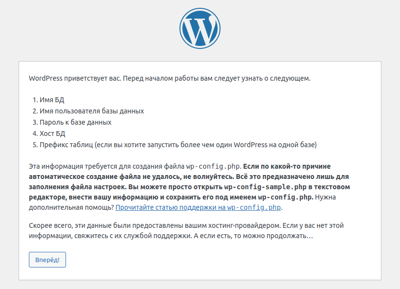
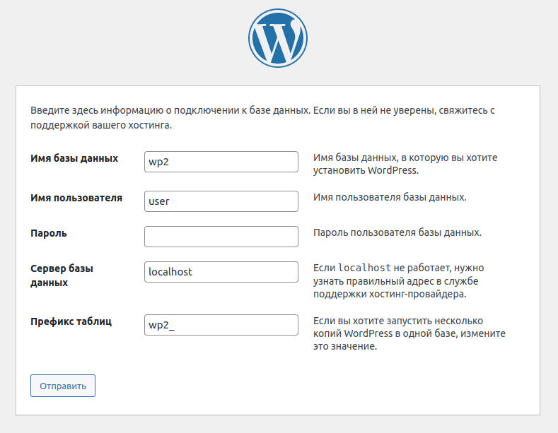
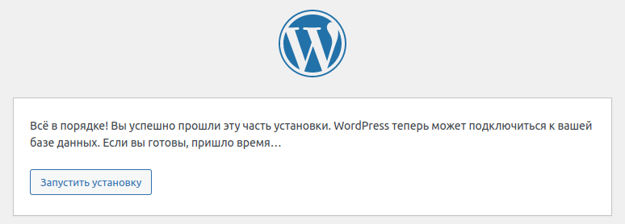
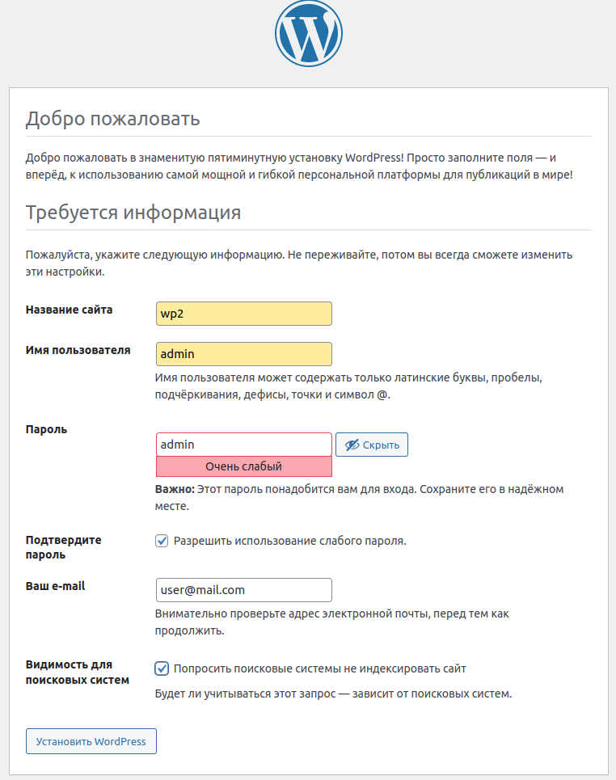
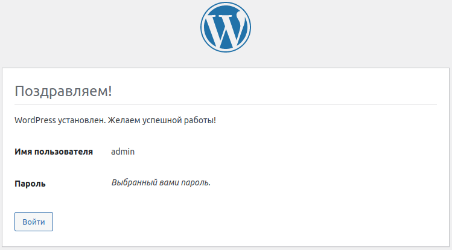
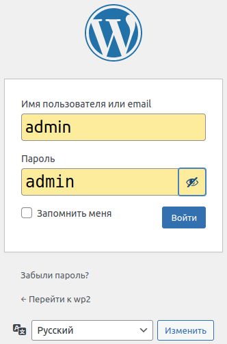

[Wordless](https://wordless.readthedocs.io/en/latest/index.html) - это микро-фреймворк для разработки пользовательских тем, который представляет из себя плагин для WordPress и содержит стартовую тему. Wordless значительно ускоряет и улучшает создание пользовательских тем. Перечислим особенности Wordless:

- Создание новых тем с помощью WP-CLI
- Написание шаблонов PHP с помощью языка шаблонов PUG
- Написание таблиц стилей CSS, используя синтаксис SCSS
- Написание логики Javascript, используя синтаксис ES2015
- Предварительно настроенная поддержка перехватчика сообщений MailHog.
- Поддержка WebPack, BrowserSync (с живой перезагрузкой), WP-CLI, Yarn.

Скомпилированная тема будет работать на любой стандартной инсталяции Wordpress.

Wordless не изменяет никаких основных функциональных возможностей, поэтому он совместим практически с любым плагином.

Дальше мы будем исходить из того, что у вас не установлена WordPress. 

Вы можете установить Wordless и WordPess одним махом. Для этого, вам нужно устанавить Wordless, а он автоматичестки установит все необходимое, в том числе и WordPress. [Есть оффициальное руководство](https://wordless.readthedocs.io/en/latest/_pages/install/prerequisites.html), как выполнить такую установку. Однако, мне не удалось пройти этот квест до конца, так как постоянно возникали какие-либо ошибки. Это и послужило поводом написать эту статью.

Другой вариант, который рассматривается в этой статье, сначала устанавливается и настраивается WordPress, а затем добавляется и настраивается Wordless.

Первым делом установим WP-CLI

## WP-CLI

[WP-CLI](https://wp-cli.org/) - это интерфейс командной строки для WordPress. С помощью WP-CLI можно обновлять плагины, настраивать многосайтовые установки и многое другое, не используя веб-браузер. На странице [WP-CLI Commands](https://developer.wordpress.org/cli/commands/) приведен список всех доступных в настоящее время команд WP-CLI со ссылками на документацию по использованию и подкомандам. На странице [WP-CLI Handbook](https://make.wordpress.org/cli/handbook/) находится список полезных руководств и ресурсов по использованию WP-CLI.

 С помощью утилиты curl загрузим файл wp-cli.phar, для этого в терминале введем следующее:

```
curl -O https://raw.githubusercontent.com/wp-cli/builds/gh-pages/phar/wp-cli.phar
```

Файл загрузится в 'Домашнюю папку'.

Затем проверим работоспособность файла wp-cli.phar:

```
php wp-cli.phar --info
```

Чтобы использовать WP-CLI из командной строки, набирая команду wp, сделаем файл исполняемым и переместим его куда-нибудь из домашней папки. Например:

```
chmod +x wp-cli.phar
sudo mv wp-cli.phar /usr/local/bin/wp
```

Теперь проверим, как работает WP-CLI:

```
wp --info
```

Будет выведена информация, похожая на эту:

```
OS:	Linux 5.15.0-52-generic #58~20.04.1-Ubuntu SMP Thu Oct 13 13:09:46 UTC 2022 x86_64
Shell:	/bin/bash
PHP binary:	/usr/bin/php7.4
PHP version:	7.4.3
php.ini used:	/etc/php/7.4/cli/php.ini
MySQL binary:	/usr/bin/mysql
MySQL version:	mysql  Ver 8.0.30-0ubuntu0.20.04.2 for Linux on x86_64 ((Ubuntu))
SQL modes:
WP-CLI root dir:	phar://wp-cli.phar/vendor/wp-cli/wp-cli
WP-CLI vendor dir:	phar://wp-cli.phar/vendor
WP_CLI phar path:	/home/user
WP-CLI packages dir:
WP-CLI cache dir:	/home/user/.wp-cli/cache
WP-CLI global config:
WP-CLI project config:
WP-CLI version:	2.7.1
```

## Установка WordPress на localhost

Загрузите последнюю версию WordPress с [оффициального сайта](https://wordpress.org/latest.zip), либо его [руссифицированную версию](https://ru.wordpress.org/latest-ru_RU.zip).

Распакуйте скачаный архив в `Домашнюю папку`. В результате появится каталог `wordpress`, который переименуйте в `wp2` (просто wp2 короче, чем wordpress).

Для WordPress требуется база данных MySQL. Вы можете проверить, установлена ли MySQL в вашей системе, а также увидеть дополнительную информацию:

```
sudo service mysql status
```

Руководство по установке MySQL находится [здесь](https://dev.mysql.com/doc/refman/8.0/en/installing.html).

После установки MySQL нужно создать базу данных для будущего локального сайта wp2. Войдите в консоль сервер MySQL как root-пользователь:

```
sudo mysql -u root
```

В строке с приглашением `mysql>` введите следующее:

```SQL
CREATE DATABASE wp2;
```

На сервере MySQL будет создана база данных `wp2`.

Также, на сервере MySQL создайте пользователя с именем, под которым вы зарегистрированы в вашей операционной системе. Для дальнейших примеров пусть это будет пользователь с именем user:

```SQL
CREATE USER user@localhost IDENTIFIED BY '';
```

Предоставьте пользователю user привилегии на чтение, вставку, обновление, удаление, создание и изменение во всех таблицах базы данных wp2 с локального хоста:

```SQL
GRANT SELECT,INSERT,UPDATE,DELETE,CREATE,DROP,ALTER ON wp2.* TO user@localhost;
```

и рекомендуется еще перечитать привелегии:

```SQL
FLUSH PRIVILEGES;
```

Выйдите из консоли MySQL:

```
exit
```

Запустите на, всякий случай, сервер MySQL:

```
sudo service mysql start
```

Сделаем каталог `wp2` рабочим:

```
cd wp2
```

Обычно, для установки WordPress на локальный сервер используют LAMPP, XAMPP или что-то еще. Однако, благодаря WP-CLI у нас есть возможность запускать встроенный сервер командой wp server, что мы и сделаем:

```
wp server
```

Должна появиться строка примерно такого вида:

```
[Fri Oct 28 20:24:07 2022] PHP 7.4.3 Development Server (http://localhost:8080) started
```

В дальнейшем, это окно терминала не трогаем, а при необходимости запустите новое окно.

1. Теперь, откройте браузер и перейдите по ссылке http://localhost:8080. Откроется следующее окно:



2. Нажмите кнопку Вперед! Появится следующее окно, в котором заполним поля согласно скриншоту:



3. Нажмите кнопку Отправить, появится следующее окно:



4. Нажмите кнопку Запустить установку, появится следующее окно, в котором заполните поля согласно скриншоту:



5. Нажмите кнопку Установить WordPress, появится следующее окно:



6. Нажмите кнопку Войти! Появится форма ввода пароля, в которую введите данные согласно скриншоту:



7. Нажмите кнопку Войти. Вы войдете в Консоль административной панели WordPress.

## Установка Node, NVM, Yarn, Ruby

Каждая версия [Wordless](https://github.com/welaika/wordless_gem) соглашается работать с определенной версией Node. Последний Wordless версии 2.2.0 требует для своей работы Node v14.15.3.

В вашей системе, скорее всего, установлен Node другой версии. Чтобы убедиться в этом, откройте новое окно терминала и введите следующую команду:

```Bach
node -v
```

будет выведена версия Node, установленная в вашей системе.

Чтобы легко устанавливать и переключаться между различными версиями Node, воспользуйтесь менеджером NVM. Проверьте, установлен ли NVM в вашей системе:

```Bash
nvm -v
```

Если NVM установлен, то будет показан номер версии, либо будет выдано сообщение, что команда не найдена. Тогда [установите NVM](https://github.com/nvm-sh/nvm/blob/master/README.md#installing-and-updating) с помощью утилиты curl:

```Bash
curl -o- https://raw.githubusercontent.com/nvm-sh/nvm/v0.39.2/install.sh | bash
```

Теперь, с помощью NVM установите Node v14.15.3:

```Bash
nvm install 14.15.3
```

Указанная версия Node была установлена и сделана рабочей. Более подробно читайте [Управление версиями Node.js и NPM с помощью NVM](https://habr.com/ru/company/timeweb/blog/541452/).

Рекомендуется, также, установить Yarn. Это легко сделать командой NPM:

```Bash
npm i -g yarn
```

Для того, чтобы установить [Wordless](https://wordless.readthedocs.io/en/latest/index.html) требуется язык Ruby. Проверим наличие этого языка в системе:

```
ruby -v
```

Если язык установлен, то будет выведена запись, похожая на эту:

```
ruby 2.7.0p0 (2019-12-25 revision 647ee6f091) [x86_64-linux-gnu]
```

Если язык не установлен, то будет выведено сообщение, что команда не найдена. Тогда установим Ruby. В Ubuntu это делается так:

```
sudo apt-get install ruby-full
```

Установка для других систем приведена на [этой странице](https://www.ruby-lang.org/ru/documentation/installation/).

## Установка Wordless

Теперь установите из репозитория Ruby пакет wordless:

```
sudo gem install wordless
```

Сделайте каталог `wp2` рабочим:

```
cd wp2
```

Установите и активируйте плагин Wordless:

```
wp plugin install --activate wordless
```

Создайте новую тему c именем mytheme:

```
wp wordless theme create mytheme
```

В каталоге `/wp2/wp-content/themes` будет создан каталог `mytheme` с только что созданной темой. Сделаем этот каталог рабочим:

```
cd wp-content/themes/mytheme
```

Настройте остальные необходимые инструменты:

```
yarn setup
```

В процессе выполнения этой команды появляется следующий вопрос:

```
Are you sure you want to drop the 'mytheme_test' database? [y/n]
```

Независимо от введенного ответа у меня появлялась куча ошибок. Лечится это так. Откройте файл `wp2/wp-config.php` и найдите:

- в трех местах `define( 'DB_NAME', 'mytheme_test' );` 
  - и замените `define( 'DB_NAME', 'wp2' );`, 
- в двух местах `define( 'DB_USER', 'root' );` 
  - и замените на `define( 'DB_USER', 'user' );`
- в двух местах `define( 'DB_PASSWORD', 'mysql' );`
  - и замените на `define( 'DB_PASSWORD', '' );`
- в двух местах `define( 'DB_HOST', 'mysql' );` 
  - и замените на `define( 'DB_HOST', 'localhost' );`
  
Затем, запустите сервер:

```
yarn run server
```

И повторите установку WordPress с шага 4.


