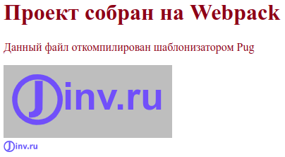

## О чем статья

В статье подробно описывается настройка сборщика Webpack 5. Статья покажет, как установить и настроить Webpack и необходимые модули, которые позволят создавать фронтенд сайта и использовать для этого следующие инструменты:

- Шаблонизатор Pug. Он используется для разметки, которая будет автоматически преобразовываться в разметку HTML.
- Препроцессор Sass для стилей, которые будут автоматически преобразовываться в стили CSS.
- Язык JavaScript для создания интерактивности сайта, при этом, сборка позволит использовать последние достижения языка и не переживать, что новую функцию не распознает старый браузер.
- Разметка Markdown для наполнения содержимого страниц сайта. Разметка Markdown преобразуется в понятный для браузеров HTML.

Освоив необходимый минимум можно без труда доработать созданный шаблон для работы с React или Vue

## Полезные ресурсы для настройки webpack

Настройка Webpack заставляет постоянно редактировать файл `webpack.config.js`. Поэтому, полезно держать под рукой справочник, в который можно заглянуть. Официальный сайт Webpack'а предлагает такой справочник, который представляет файл конфигурации с [интерактивными опциями](https://webpack.js.org/configuration/#options), если нажать на название непонятной опции, откроется страница с подробной документацией.

Рекомендую посетить сервис [createapp.dev](https://createapp.dev/), который поможет создать готовый шаблон проекта с необходимыми настройками. Этот сервис настраивает проект под Webpack, Parcel и Snowpack и полезен для опытных пользователей. Для тех, кто впервые столкнулся с настройкой Webpack или не уверенно разбирается в теме, лучше прочитать эту статью и собрать проект самостоятельно.

## Быстрый запуск Webpack

Чтобы выполнять дальнейшие действия, установите на компьютер [Node.js](https://nodejs.org/) и редактор кода, а также нужен браузер.

Дальнейшие действия выполнялись в ОС Ubuntu 20.04 с NodeJS v16.17.1 и NPM v8.15.0, использовался стандартный Терминал и стандартный Текстовый редактор.

Откроем терминал и создадим каталог будущего проекта, и сразу перейдем в него:

```
mkdir my-project
cd my-project
```

Теперь, если нужна [система контроля версий Git](https://git-scm.com/), то выполним два шага. Сначала, инициализируем Git:

```
git init
```

Будет создан скрытый каталог `.git`, в котором будут хранится необходимые файлы git-репозитория. Чтобы в файловом браузере увидеть каталог `.git` нажмем комбинацию клавиш `Ctrl+H`.

Затем, в корне проекта создадим скрытый файл `.gitignore`:

```
touch .gitignore
```

В этом файле будем указывать имена и шаблоны для файлов и каталогов, которые не нужны в репозитории. С помощью редактора кода откроем файл `.gitignore` и запишем следующее:

```
node_modules
```

Эта запись означает для Git - игнорировать каталог `node_modules`, не отслеживать и не добавлять каталог в репозиторий.

С настройками Git в этом проекте закончим. Теперь, не забываем, иногда, а лучше, почаще, делать коммиты.

Теперь, инициализируем npm, для этого в терминале введем команду:

```
npm init -y
```

В корне проекта автоматически создается файл `package.json` с настройками по умолчанию, на что указывает опция `-y`. Подробно о файле `package.json` читайте в [документации по npm](https://docs.npmjs.com/cli/v8/configuring-npm/package-json).

Теперь установим `webpack` и `webpack-cli`, который используется для запуска webpack в командной строке. Для этого, в открытом терминале введем следующее:

```
npm i -D webpack webpack-cli
```

Опция `-D` указывает, что установленные пакеты нужны только для режима `development` и не будут использоваться в производственной сборке. В файле `package.json` эти пакеты помещаются в секцию `"devDependencies": {...}`.

В результате выполнения команды выше, создается каталог `node_modules` и файл `package-lock.json`. Каталог `node_modules` содержит установленные зависимости проекта. Этот каталог не рекомендуется включать в репозитории, что и указали раньше в файле `.gitignore`. Файл `package-lock.json` хранит записи о точных версиях установленных зависимостей.

С помощью открытого терминала создадим каталог `src`:

```
mkdir src
```

В корне проекта создается каталог `src` для исходного кода. Первым файлом в каталоге `src` создадим файл `index.js` со следующим кодом:

```js
function component(text) {
  const element = document.createElement('h1');
  element.textContent = text;
  return element;
}

document.body.append(component('Проект собран на Webpack'));
```

В редакторе кода откроем `package.json` и добавим в поле `"scripts"` следующую строку кода:

```json
"scripts": {
  "dev": "webpack --mode development",
}
```

`dev` - это произвольное сокращенное имя для команды `webpack --mode development`. Подобные команды в секции `"scripts"` файла `package.json` запускаются в Node.js с помощью команды `npm run`. Так, для запуска команды выше, введем в терминале следующую команду:

```
npm run dev
```

В результате, в корне проекта появится каталог `dist`, в который скомпилируется файл `main.js`. Если сравнить содержимое файла `main.js` с исходным `index.js`, то увидим отличия.

Команда `npm run build` в этом случае выполнит webpack в режиме `development`. Перед началом выполнения webpack будет искать в корне проекта файл `webpack.config.js` с настройками. Так как, файл не создали, то применяются настройки по умолчанию. Webpack определит точку входа в каталоге `src`, это файл `index.js`, и выведет откомпилированный код в `dist/main.js` (точка выхода). Подробно об изменении настроек по умолчанию смотри [Настройка в webpack точки входа и выхода](#настройка-в-webpack-точки-входа-и-выхода).

Теперь создадим HTML файл, который будет загружать скрипт `main.js`. Для этого, в каталоге `dist` создадим файл `index.html` со следующим содержимым:

```html
<!DOCTYPE html>
<html>
  <head>
    <meta charset="utf-8" />
    <title>Быстрый запуск Webpack</title>
  </head>
  <body>
    <p>Файл создан вручную</p>
    <script src="main.js"></script>
  </body>
</html>
```

Файловая структура нашего проекта выглядит так:

```
my-project
  |-dist
    index.html
    main.js
  |+node_modules
  |-src
    index.js
  package-lock.json
  package.json
```

Файл `dist/index.html` откроем в браузере и увидим следующее:

```
Проект собран на Webpack
Файл создан вручную
```

## Установка и настройка html-webpack-plugin

В примере выше сборка не работает в браузере, пока вручную не добавили файл `index.html`. Поэтому, настроим webpack, чтобы HTML-файл автоматически создавался в готовой сборке из исходного шаблона. Для этого используем html-webpack-plugin.

Из терминала установим плагин:

```
npm i -D html-webpack-plugin
```

Теперь настроим html-webpack-plugin. Для этого создадим в корне проекта файл `webpack.config.js` и заполним его следующим содержимым.

```js
const HtmlWebpackPlugin = require('html-webpack-plugin');
const path = require('path');

module.exports = {
  plugins: [
    new HtmlWebpackPlugin({
      template: path.join(__dirname, 'src', 'template.html'),
      filename: 'index.html',
    }),
  ],
};
```

Для файла `webpack.config.js` разберем содержимое:

- Первые две строки импортируют пакеты `html-webpack-plugin` и `path` и определяют эти модули в переменные `HtmlWebpackPlugin` и `path` соответственно.

- `module.exports = {}` - объект, который экспортируется как модуль по умолчанию.

- Для плагина `html-webpack-plugin` создается экземпляр `new HtmlWebpackPlugin` с двумя заданными свойствами: `template` - путь к входному файлу и `filename` - имя выходного файла.

В свойстве `template` разберем путь, который, на первый взгляд, сложен для понимания.

В Linux и macOS пути выглядят так: `/path/to/template.html`. В Windows пути выглядят иначе: `C:\path\to\template.html`. Модуль `path` учитывает эти различия в Node.js. `path` подключили во второй строке файла `webpack.config.js`, а затем вызвали в свойстве `template`. Метод [path.join](https://nodejs.org/dist/latest-v16.x/docs/api/path.html#pathjoinpaths) объединяет заданные сегменты пути вместе и использует необходимый разделитель для конкретной системы. Сегменты пути для метода `path.join` задали тремя аргументами `__dirname`, `'src'` и `'template.html'`. В ОС Linux можно вместо такого кода `template: path.join(__dirname, 'src', 'template.html')` указать проще - `template: './src/template.html'`

- `__dirname` - глобальная константа, которая указывает абсолютный путь к каталогу файла, код которого запрашивает эту константу, т. е. в нашем случае, это файл `webpack.config.js`, а `__dirname` содержит абсолютный путь к корневому каталогу проекта.

Вместо метода `path.join` часто применяют метод [path.resolve](https://nodejs.org/dist/latest-v16.x/docs/api/path.html#pathresolvepaths).

Файл настроек [webpack.config.js](https://webpack.js.org/configuration/#options) нужен вебпаку, чтобы он знал, какие плагины и с какими настройками использовать в том или ином случае. Webpack автоматически определит, если файл настроек лежит в корне проекта и называется `webpack.config.js`. При смене имени или расположения файла настроек, укажите это с помощью опции `--config` в файле `package.json`:

```json
"scripts": {
  "serve": "webpack serve --open --mode development --config serve.config.js"
}
```

В каталоге `src` создадим входной файл `template.html` с такой разметкой:

```html
<!DOCTYPE html>
<html>
  <head>
    <meta charset="utf-8" />
    <title>Быстрый запуск Webpack</title>
  </head>
  <body>
    <p>Файл создан плагином html-webpack-plugin</p>
  </body>
</html>
```

Теперь, удалим каталог `dist` с двумя файлами. В корне проекта откроем терминал и запустим команду:

```
npm run dev
```

Каталог `dist` снова создан, а внутри него созданы файлы `index.html` и `main.js`. Если откроем в браузере файл `dist/index.html`, то увидим:

```
Проект собран на Webpack
Файл создан плагином html-webpack-plugin
```

Таким образом, плагин html-webpack-plugin сделал две вещи:

- создал файл `dist/index.html` из файла `src/template.html`
- в файле `dist/index.html` прописал файл `dist/main.js`

Теперь, разрабатывать проект можно по следующему алгоритму:

1. Редактируем исходный код в файлах каталога `src`
2. Сохраняем результат
3. Выполняем сборку проекта следующей командой:

```
npm run dev
```

4. Открываем в браузере файл `dist/index.html`, либо если этот файл открытый, перезагружаем страницу браузера.
5. Смотрим на полученный результат в браузере и если надо, повторяем шаги сначала.

## Установка и настройка DevServer

При разработке проекта нужно каждый раз запускать в терминале команду `npm run dev` и вручную обновлять страницу браузера. Это быстро надоедает. Для уменьшения количества рутинных операций, автоматизируем процесс.

В webpack доступно три способа, которые могут автоматически компилировать код при сохранении:

1. [Режим Watch](https://webpack.js.org/guides/development/#using-watch-mode)
2. [webpack-dev-server](https://webpack.js.org/guides/development/#using-webpack-dev-server)
3. [webpack-dev-middleware](https://webpack.js.org/guides/development/#using-webpack-dev-middleware)

Здесь рассмотрим вариант с веб сервером. С помощью терминала установим webpack-dev-server:

```
npm i -D webpack-dev-server
```

Откроем файл `webpack.config.js` и добавим настройки для веб сервера:

```js
const HtmlWebpackPlugin = require('html-webpack-plugin');
const path = require('path');

module.exports = {
  plugins: [
    new HtmlWebpackPlugin({
      template: path.join(__dirname, 'src', 'template.html'),
      filename: 'index.html',
    }),
  ],
  devServer: {
    watchFiles: path.join(__dirname, 'src'),
    port: 9000,
  },
};
```

Для `devServer` указали два свойства:

- `watchFiles` указывает на каталог `src`, за которыми будет вестись наблюдение и в случае, если в каталоге произойдут изменения, веб сервер автоматически сделает сборку проекта и перезагрузит страницу браузера.
- `port` указывает порт на котором будет работать веб-сервер, по умолчанию - localhost:8080.

Чтобы запускать веб сервер короткой командой создадим для CLI скрипт "serve" в файле `package.json`:

```json
{
  "scripts": {
+   "serve": "webpack serve --open --mode development",
    "dev": "webpack --mode development",
    "test": "echo \"Error: no test specified\" && exit 1"
  }
}
```

`serve` означает запустить веб сервер. [`--open`](https://webpack.js.org/configuration/dev-server/#devserveropen) автоматически запускает браузер по умолчанию. `--mode development` включает режим разработки.

Перед тем как запустить веб сервер удалим каталог `dist`. Это делать необязательно, а нужно для понимания работы веб-сервера.

В терминале запустим веб сервер командой:

```
npm run serve
```

В результате откроется страница браузера по адресу http://localhost:9000/ и мы увидим тоже, что и в прошлый раз:

```
Проект собран на Webpack
Файл создан плагином html-webpack-plugin
```

Но, если посмотрим на файловую структуру проекта, то не увидим, каталога `dist`. Тогда откуда браузер берет данные?

webpack-dev-server компилирует исходный код, и записывает файлы в оперативную память.

Теперь файловая структура нашего проекта будет выглядеть так:

```
my-project
  |-node_modules
  |-src
    index.js
    template.html
  package-lock.json
  package.json
  webpack.config.js
```

Веб-сервер можно становить, если терминале нажать сочетание клавиш Ctrl+C.

## Настройка в Webpack точки входа и выхода

В Webpack'е с четвертой версии не требуется задавать точки входа и выхода, а допускается использовать настройки по умолчанию: точка входа - `./src/index.js` и точка выхода - `./dest/main.js`. Это упрощает настройки, когда проект несложный. При попытке расширить функциональность, без настроек точек входа и выхода не обойтись.

### Точка входа

**Точка входа** - файл, который Webpack компилирует первым и если в этом файле подключаются зависимости, то эти зависимости тоже обрабатываются.

С помощью настроек, укажем, использовать точку входа. Для этого в файл `webpack.config.js` добавим свойство `entry`:

```js
module.exports = {
  entry: path.join(__dirname, 'src', 'index.js'),
};
```

Теперь, чтобы изменить точку входа изменяем значение свойства `entry`. Также, можно задать несколько точек входа. Это нужно при [разделении кода](https://webpack.js.org/guides/code-splitting/) на части. Подробно о настройках точки входа читайте в статьях [Entry Points](https://webpack.js.org/concepts/entry-points/) и [Entry and Context](https://webpack.js.org/configuration/entry-context/).

### Точка выхода

**Точка выхода** - каталог, в который Webpack компилирует точки входа.

Точка выхода настраивается в файле `webpack.config.js` с помощью свойства `output`:

```js
module.exports = {
  output: {
    path: path.join(__dirname, 'dist'),
    filename: 'index.[contenthash].js',
  },
};
```

где:

- `[contenthash]` - шаблон, в который подставляется хеш, сгенерированный на основе контента файла. Хеширование меняет имя после каждого изменения содержимого файла. Это решает проблему версионирования. Если хеш изменился, то браузер берет не старый файл из кеша, а загружает новый с сервера. 20 знаков хеша сократить до нужного количества символов можно следующим образом: [contenthash:8]. Хеш будет длиной 8 символов. Подробно о шаблоне хешей читайте в статье [Hash vs chunkhash vs ContentHash](https://medium.com/@sahilkkrazy/hash-vs-chunkhash-vs-contenthash-e94d38a32208).

Подробно о точках выхода описывается в статьях [concepts/output](https://webpack.js.org/concepts/output/) и [configuration/output](https://webpack.js.org/configuration/output/).

Теперь файл `webpack.config.js` выглядит так:

```js
const HtmlWebpackPlugin = require('html-webpack-plugin');
const path = require('path');

module.exports = {
  entry: path.join(__dirname, 'src', 'index.js'),
  output: {
    path: path.join(__dirname, 'dist'),
    filename: 'index.[contenthash].js',
  },
  plugins: [
    new HtmlWebpackPlugin({
      template: path.join(__dirname, 'src', 'template.html'),
      filename: 'index.html',
    }),
  ],
  devServer: {
    watchFiles: path.join(__dirname, 'src'),
    port: 9000,
  },
};
```

ЗВ терминале запустим следующую команду:

```
npm run dev
```

В корне проекта появится каталог `dist`, в котором будут два файла: `index.html` и `index.d0b265b1468ab7c3a3c1.js`. Второй файл раньше назывался `main.js`. Код в имени файла - хеш, который будет меняться с изменением содержимого файла.

## Автоматическая очистка каталога dist

Перед каждым запуском вебпака полезно очищать каталог dist. Это предотвратит накапливание в ненужных файлов. Для этого применим [filemanager-webpack-plugin](https://github.com/gregnb/filemanager-webpack-plugin).

Для начала, установим filemanager-webpack-plugin:

```
npm i -D filemanager-webpack-plugin
```

Затем, в файле webpack.config.js настроим:

```js
  const HtmlWebpackPlugin = require('html-webpack-plugin');
  const path = require('path');
+ const FileManagerPlugin = require('filemanager-webpack-plugin');

  module.exports = {
    plugins: [
      new HtmlWebpackPlugin({
        ...
      }),
+     new FileManagerPlugin({
+       events: {
+         onStart: {
+           delete: ['dist'],
+         },
+       },
+     }),
    ],
    devServer: {
      ...
    },
  };
```

Каталог `dist`, если быть точным, не очищается, а удаляется. Плагин `filemanager-webpack-plugin` может также копировать, создавать, перемещать, архивировать файлы и каталоги перед началом сборки `onStart` и по окончании `onEnd`. В дальнейшем, воспользуемся плагином для копирования файлов.

## Настройка режима production и создание производственной сборки

До сих пор webpack использовался в режиме разработки. Теперь создадим производственную сборку, чтобы получить готовое приложение, которое размещается на удаленном сервере.

В файле `package.json` добавим скрипт `"build"`:

```json
  "scripts": {
    "serve": "webpack serve --open --mode development",
    "dev": "webpack --mode development",
+   "build": "webpack --mode production",
    "test": "echo \"Error: no test specified\" && exit 1"
  },
```

Прежде чем выполнить нижеприведенную команду, откроем файл `dist/index.6ab939774fe4ecf4a2d6.js` в редакторе кода и посмотрим на него. Видим кучу комментариев и код представлен в не сжатом виде. Размер файла составляет 1424 байта.

Запустим в терминале вебпак в режиме продакшн:

```
npm run build
```

После этого, посмотрим на содержимое файла `dist/index.js`, в котором увидим, что отсутствуют комментарии и сжат код. Размер самого файла составит 139 байт. Этим режим production отличается от режима development - код конечного бандла сжимается. То же относится и к файлу `index.html`, который в режиме development не сжимается и размер файла составляет 273 байта, а в режиме production убираются пробелы и ненужные символы и размер файла становится равен 250 байт.

## Babel

Большинство новых браузеров поддерживают все новые возможности JavaScript ES6-ES13. Но, многие из этих возможностей не поддерживаются старыми браузерами, которые до сих пор используются в мире. Поэтому, если для важно сохранять поддержку этих браузеров, то самым распространенный способ - применить [Babel](https://babeljs.io/). Babel - это компилятор, который адаптирует неподдерживаемые функции JavaScript для устаревших браузеров.

> Чтобы посмотреть, какие браузеры поддерживают ту или иную функцию воспользуемся сервисом [Can I use](https://caniuse.com/). Если в строке `Can I use______?` ввести `es13`, то будет выведен список функций, которые ожидаются в 13-ом выпуске ECMAScript. При выборе функции, показывается таблица с браузерами, которые поддерживают или не поддерживают эту функцию.

Babel позволяет писать код с использованием новых возможностей JavaScript ES6-ES13. При этом можно не заботится о том, что функция не будет поддерживаться старым браузером. Babel транспилирует JavaScript код в ES5, а браузеры, которые не поддерживают этот стандарт уже никем не используются. Для работы самого Babel требуется два пакета `@babel/core` и `@babel/preset-env`, а чтобы Babel работал с Webpack требуется загрузчик `babel-loader`. Установим эти три пакета одной командой:

```
npm i -D @babel/core @babel/preset-env babel-loader
```

Конфигурацию для Babel зададим в файле `.babelrc`. В корне проекта создадим этот файл:

```
touch .babelrc
```

Откроем `.babelrc` и внесем следующий код:

```json
{
  "presets": [
    [
      "@babel/preset-env",
      {
        "modules": false
      }
    ]
  ]
}
```

Теперь, откроем файл `webpack.config.js` и добавим настройки для Babel:

```js
module.exports = {
  ...
  module: {
    rules: [
      {
        test: /\.js$/,
        use: 'babel-loader',
        exclude: /node_modules/,
      },
    ],
  },
};
```

Здесь видим объект `module`, для которого задано правило `rules`. Для вебпака файл - это модуль, будь то скрипт, стили, шрифт или изображение.

## Подключение шаблонизатора Pug

На чистом HTML верстать можно, но трудно поддерживать большие проекты. Поэтому, умные люди придумали инструменты, которые называются шаблонизаторами.

Шаблонизаторы позволяют:

- создавать шаблоны, компоненты, блоки
- работать с данными, подставляя эти данные в код. Шаблонизатор может автоматически создать карточки, если подставлять данные в компонент из объекта JSON. Также, можно менять классы, если изменять данные, что позволяет управлять интерфейсом компонентов.
- задавать условные выражения и циклы, как в языках программирования.

В этой статье рассмотрим [шаблонизатор Pug](https://pugjs.org/), который написан на JavaScript и выполняется в среде Node.js. Шаблонизатор Pug использует синтаксис, основанный на отступах и отличается от синтаксиса HTML отсутствием угловых скобок и закрывающихся тегов. После компиляции синтаксис Pug превращается в HTML код.

Webpack имеет плагин и загрузчик файлов [pug-loader](https://www.npmjs.com/package/pug-loader) для шаблонизатора Pug.

> Загрузчик pug-loader не поддерживает Pug 3-ей версии. Кому это нужно, предлагаю два варианта решения:
>
> - Сравнительно недавно появился [pug-plugin](https://www.npmjs.com/package/pug-plugin), который работает с Webpack 5 и Pug 3.
> - Самостоятельно настроить pug-loader для третьей версии Pug, и дождаться, пока разработчики плагина сами это сделают. Это способ, которым пользуется автор этой статьи, об этом способе читайте в статье [XXXXXX](XXXXXXXXXXXXXXXXXXXXXXXXXXXXXXXXXXXXXXX)

Установим pug и pug-loader

```
npm i -D pug pug-loader
```

Вебпаку в файле `webpack.config.js` укажем, что используем плагин `pug-plugin` для файлов с расширением `.pug`:

```js
const HtmlWebpackPlugin = require('html-webpack-plugin');
const path = require('path');

module.exports = {
  entry: path.join(__dirname, 'src', 'index.js'),
  output: {
    path: path.join(__dirname, 'dist'),
    filename: 'index.[contenthash].js',
  },
  plugins: [
    new HtmlWebpackPlugin({
+     template: path.join(__dirname, 'src', 'index.pug'),
      filename: 'index.html',
    }),
  ],
  devServer: {
    watchFiles: path.join(__dirname, 'src'),
    port: 9000,
  },
  module: {
    rules: [
      {
        test: /\.js$/,
        use: 'babel-loader',
        exclude: /node_modules/,
      },
+     {
+       test: /\.pug$/,
+       loader: 'pug-loader',
+     },
    ],
  },
};
```

Создадим файл `./src/index.pug` и напишем в нем следующее:

```pug
html
  head
    meta(charset='utf-8')
    title= 'Быстрый запуск Webpack'
  body
    p Файл откомпилирован шаблонизатором Pug
```

Файл `src/template.html` теперь удалим.

В терминале запустим команду:

```
npm run serve
```

Откроется страница браузера по адресу http://localhost:9000/, на которой увидим:

```
Проект собран на Webpack
Файл откомпилирован шаблонизатором Pug
```

## Загрузка стилей

Для написания стилей будем использовать препроцессор [Sass](https://sass-lang.com/dart-sass), который расширяет возможности CSS и упрощает создание CSS-кода, а также преобразует SCSS в CSS. Затем, будем прогонять этот CSS через постпроцессор PostCSS, чтобы большинство браузеров понимало эти стили.

Установим необходимые пакеты:

```
npm i -D sass-loader postcss-loader postcss-preset-env css-loader style-loader sass
```

где:

- [sass-loader](https://www.npmjs.com/package/sass-loader) - загрузчик файлов Sass/SCSS
- [sass](https://www.npmjs.com/package/sass) компилятор файлов `.scss` в `.css`.
- [postcss-loader](https://www.npmjs.com/package/postcss-loader) - загрузчик CSS файлов для пост-обработки. Должен работать с каким нибудь плагином.
- [postcss-preset-env](https://www.npmjs.com/package/postcss-preset-env) - плагин для PostCSS, который конвертирует современный CSS в код, понятный большинству браузеров, включением необходимых полифилов.
- [css-loader](https://www.npmjs.com/package/css-loader) загрузчик CSS-файлов
- [style-loader](https://webpack.js.org/loaders/style-loader/) загрузчик стилей в DOM

> Если требуется использовать только CSS и не пользоваться преимуществами SCSS и PostCSS, то ставьте только `css-loader` и `style-loader`.

Создадим файл `src/main.scss` и внесем в него следующее:

```scss
$font-size: 1rem;
$font-color: lch(28 99 35);

html {
  font-size: $font-size;
  color: $font-color;
}
```

В файле используются переменные Sass и [LCH цвета](https://habr.com/ru/company/ruvds/blog/496966/), которые поддерживаются не всеми браузерами, но PostCSS транспилирует эти цвета в понятные любому браузеру.

В файле `src/index.js` сделаем импорт файла main.scss:

```js
import './main.scss';
```

Такой импорт стилей в скрипт не поддерживается языком JavaScript, а возможен благодаря webpack.

В `webpack.config.js` настроим пакеты:

```js
const HtmlWebpackPlugin = require('html-webpack-plugin');
const path = require('path');

module.exports = {
  entry: path.join(__dirname, 'src', 'index.js'),
  output: {
    path: path.join(__dirname, 'dist'),
    filename: 'index.[contenthash].js',
  },
  plugins: [
    new HtmlWebpackPlugin({
      template: path.join(__dirname, 'src', 'index.pug'),
      filename: 'index.html',
    }),
  ],
  devServer: {
    watchFiles: path.join(__dirname, 'src'),
    port: 9000,
  },
    module: {
    rules: [
      {
        test: /\.js$/,
        use: 'babel-loader',
        exclude: /node_modules/,
      },
      {
        test: /\.pug$/,
        loader: 'pug-loader',
      },
+     {
+       test: /\.(scss|css)$/,
+       use: ['style-loader', 'css-loader', 'postcss-loader', 'sass-loader'],
+     },
    ],
  },
};
```

Указываем вебпаку, какие загрузчики стилей применять. Причем, порядок их перечисления в массиве важен, так как загрузчики используются вебпаком от последнего к первому:

- Так что последним в списке должен быть sass-loader, который загружает файлы SCSS и компилирует его в CSS.

- Затем идет postcss-loader, который с помощью [PostCSS](https://postcss.org/) транспилирует самые современные фичи CSS (переменные, миксины и многое другое) в то, что понятно большинству браузеров. Также, PostCSS применяет автопрефиксер и линтер к CSS.

- Следующим идет css-loader, который интерпретирует @import и url() внутри CSS.

- Последним будет style-loader, который внедряет CSS в DOM

Настройки для PostCSS задаются как в файле `webpack.config.js` так и в собственном файле настроек `postcss.config.js`. СВоспользуемся вторым способомоздадим файл `postcss.config.js` и запишем в файле следующий код:

```js
module.exports = {
  plugins: {
    'postcss-preset-env': {
      browsers: 'last 2 versions',
    },
  },
};
```

В терминале запустим команду:

```
npm run serve
```

Откроется браузер и появится цветной текст.

```
Проект собран на Webpack
Файл откомпилирован шаблонизатором Pug
```

Теперь остановим сервер сочетанием клавиш Ctrl+C и введем в терминале команду:

```
npm run build
```

Если заглянем в каталог `dist`, то не обнаружим файла с расширением `.css`. Это связано с тем, что стили находятся в бандле `index.[contenthash].js`. Можем извлечь стили в отдельный файл, что позволит раздельно кэшировать JS и CSS, для этого применим плагин [mini-css-extract-plugin](https://github.com/webpack-contrib/mini-css-extract-plugin). Плагин создает CSS-файл из каждого JS-файла, в котором содержится CSS. Сначала установим `mini-css-extract-plugin`:

```
npm i -D mini-css-extract-plugin
```

Затем настроим его в файле `webpack.config.js`:

```js
const MiniCssExtractPlugin = require('mini-css-extract-plugin');

module.exports = {
  plugins: [
    new MiniCssExtractPlugin({
      filename: '[name].[contenthash].css',
    }),
  ],
  module: {
    rules: [
      {
        test: /\.(scss|css)$/,
        use: [
          MiniCssExtractPlugin.loader,
          'css-loader',
          'postcss-loader',
          'sass-loader',
        ],
      },
    ],
  },
};
```

Вместо `'style-loader'` используем `MiniCssExtractPlugin.loader`.

## Загрузка изображений

Здесь настроим webpack для работы с изображениями в формате PNG, JPG, GIF и SVG.
Начиная с webpack 5, вместо загрузчиков изображений, значков, шрифтов и т. д. используется встроенный [Asset Modules](https://webpack.js.org/guides/asset-modules/). До webpack 5 использовались [raw-loader](https://v4.webpack.js.org/loaders/raw-loader/), [url-loader](https://v4.webpack.js.org/loaders/url-loader/) и [file-loader](https://v4.webpack.js.org/loaders/file-loader/).

Для поддержки изображений устанавливать ничего не нужно, требуется только настроить `webpack.config.js`:

```js
const HtmlWebpackPlugin = require('html-webpack-plugin');
const path = require('path');

module.exports = {
  entry: path.join(__dirname, 'src', 'index.js'),
  output: {
    path: path.join(__dirname, 'dist'),
    filename: 'index.[contenthash].js',
+   assetModuleFilename: path.join('images', '[name].[contenthash][ext]'),
  },
  plugins: [
    new HtmlWebpackPlugin({
      template: path.join(__dirname, 'src', 'index.pug'),
      filename: 'index.html',
    }),
  ],
  devServer: {
    watchFiles: path.join(__dirname, 'src'),
    port: 9000,
  },
  module: {
    rules: [
      {
        test: /\.js$/,
        use: 'babel-loader',
        exclude: /node_modules/,
      },
      {
        test: /\.pug$/,
        loader: 'pug-loader',
      },
      {
        test: /\.(scss|css)$/,
        use: ['style-loader', 'css-loader', 'postcss-loader', 'sass-loader'],
      },
+     {
+       test: /\.(png|jpg|jpeg|gif)$/i,
+       type: 'asset/resource',
+     },
+     {
+       test: /\.svg$/,
+       type: 'asset/resource',
+       generator: {
+         filename: path.join('icons', '[name].[contenthash][ext]'),
+       },
+     },
    ],
  },
};
```

- `assetModuleFilename` - указывает выходной каталог и шаблон имен файлов, для модулей, которые соответствуют правилу `type: 'asset/resource'`. Если assetModuleFilename не указан, то, по умолчанию, каталогом будет `dist`, а имя файла будет `[contenthash][ext]`.

- `[ext]` - шаблон расширения файла.

- `generator.filename` - переопределяет `assetModuleFilename` для конкретного asset-правила. Здесь, svg-файлы будут выводиться в каталог `dist/icons`

- `type` имеет четыре типа asset:

  - `asset/resource` - работает так же, как и загрузчик [file-loader](https://github.com/webpack-contrib/file-loader). Модули, которые соответствуют правилу `type: 'asset/resource'` будут выводится в указанный с помощью `assetModuleFilename` каталог.

  - `asset/inline` работает как загрузчик [url-loader](https://v4.webpack.js.org/loaders/url-loader/). Модули, соответствующие правилу `type: 'asset/inline'`, встраиваются в код бандла как [Data URL](https://developer.mozilla.org/ru/docs/Web/HTTP/Basics_of_HTTP/Data_URLs).

  - `asset/source` похож на работу загрузчика [raw-loader](https://github.com/webpack-contrib/raw-loader). Модули, соответствующие правилу `type: 'asset/source'`, встраиваются без преобразований (как есть).

  - `asset` объединяет `asset/resource` и `asset/inline`. Он работает следующим образом: если размер модуля больше 8 КБ, то он работает как `asset/resource`, в противном случае - как `asset/inline`. Размер 8 КБ задан по умолчанию, но его можно изменить с помощью свойства [parser.dataUrlCondition.maxSize](https://webpack.js.org/guides/asset-modules/#general-asset-type).

Создадим каталог `src/images` и поместим в него изображение с именем `image.png`

Откроем файл `src/index.pug` и допишем в него строку с тегом `img`:

```pug
doctype html
html(lang= 'ru')
  head
    meta(charset='utf-8')
    title= 'Быстрый запуск Webpack'
  body
    p Файл откомпилирован шаблонизатором Pug
    .logo-png
      img.logo1(src=require('./images/image.png') alt='Загрузка PNG изображений с помощью Webpack')
    .logo-svg
      img.logo2(src=require('./images/logo.svg'), alt='Загрузка SVG изображений с помощью Webpack')
```

В атрибуте `src` используется `require`, т. е. изображение запрашивается как модуль.

В терминале запустим команду:

```
npm run serve
```

В окне браузера появилось два рисунка:



Размер изображения изменим через стили. Для этого откроем файл `src/main.scss` и зададим размеры для обоих изображений:

```scss
.logo1 {
  width: 10em;
}

.logo2 {
  width: 10em;
}
```

Сохраним изменения и увидим, что размер изображений стал одинаковым. При этом, мы изменили только ширину, а высота изменилась пропорционально.

## Оптимизация изображений

Многие изображения сжимаются без ухудшения визуального качества, что дает выигрыш в скорости загрузки приложения. Для этого существуют инструменты оптимизации изображений.

Векторные изображения, к которым относится формат SVG, можно неограниченно масштабировать без потери качества. SVG - текстовый язык разметки, а SVG-файлы редактируются при помощи текстовых и векторных графических редакторов. Если в SVG изображении не сильно много мелких деталей, то SVG-файлы получаются меньше по размеру, чем сравнимые по качеству изображения в форматах JPEG или GIF. SVG-файлы хорошо сжимаются. SVG применяется во фронтенде и для него придумано много инструментов. Одним из таких инструментов является минификатор [svgo](https://github.com/svg/svgo), который удаляет лишний код в разметке и тем самым уменьшает размер файла SVG.

Установим svgo:

```
npm i -D svgo
```

Теперь, чтобы заработало сжатие для SVG файлов, настроим совместную работу svgo и imagemin с помощью плагина [imagemin-svgo](https://github.com/imagemin/imagemin-svgo).

Для оптимизации растровых изображений применяется минификатор [imagemin](https://github.com/imagemin/imagemin). Для webpack существует [ImageMinimizerWebpackPlugin](https://webpack.js.org/plugins/image-minimizer-webpack-plugin/#optimize-with-imagemin) - это загрузчик и плагин для оптимизации изображений с помощью imagemin.

Сначала, установим плагин `image-minimizer-webpack-plugin` и минификатор `imagemin`:

```
npm i -D image-minimizer-webpack-plugin imagemin
```

Затем, для оптимизации изображений без потерь качества, установим следующие плагины:

```
npm i -D imagemin-gifsicle imagemin-jpegtran imagemin-optipng imagemin-svgo
```

В файл `webpack.config.js` добавим настройки:

```js
const ImageMinimizerPlugin = require('image-minimizer-webpack-plugin');

module.exports = {
  module: {
    rules: [
      ...
    ],
  },
  optimization: {
    minimizer: [
      new ImageMinimizerPlugin({
        minimizer: {
          implementation: ImageMinimizerPlugin.imageminMinify,
          options: {
            plugins: [
              ['gifsicle', { interlaced: true }],
              ['jpegtran', { progressive: true }],
              ['optipng', { optimizationLevel: 5 }],
              ['svgo', { name: 'preset-default' }],
            ],
          },
        },
      }),
    ],
  },
};
```

Для `svgo` параметры оптимизации установлены по умолчанию `{ name: 'preset-default' }`. Подробно о настройках оптимизации `svgo` читайте [здесь](https://github.com/svg/svgo).

В терминале запустим команду:

```
npm run build
```

Сравним размеры файлов изображений в каталоге `src` и `dist`. Файл `image.png` был 4,9 КБ, а стал 2,3 КБ, файл `logo.svg` был 11,4 КБ, а стал 2,5 КБ. Мы видим, заметное сжатие изображений.

## Включение синтаксиса Markdown и файлов .md в Pug

Чтобы использовать Markdown в шаблонизаторе Pug, можно применить фильтр `:markdown-it` модуля [jstransformer-markdown-it](https://github.com/jstransformers/jstransformer-markdown-it).

[Фильтры](https://pugjs.org/language/filters.html) позволяют использовать в шаблонизаторе Pug другие языки. Для начала установим модуль `jstransformer-markdown-it`:

```
npm i -D jstransformer-markdown-it
```

Теперь можем в Pug файле использовать синтаксис Markdown:

```pug
doctype html
html(lang= 'ru')
  head
    meta(charset='utf-8')
    title= 'Быстрый запуск Webpack'
  body
    p Файл откомпилирован шаблонизатором Pug
    img(src=require('./images/image.png') alt='Загрузка изображений с помощью Webpack')

    :markdown-it(linkify langPrefix='highlight-')
      ## Markdown документ

      - Написано на **Markdown**
```


либо поместить markdown разметку в файл `.md` и включить этот файл в шаблон, используя `include`:

```pug
include:markdown-it article.md
```

## Подключение шрифтов в webpack

Шрифты нашего проекта будут разместим в каталоге `src/fonts/`, поэтому, создадим этот каталог. Также, создадим в этом каталоге файл `fonts.scss`, в котором будем хранить CSS стили для шрифтов. Сразу импортируем файл `fonts.scss` в `main.scss`:

```js
import './fonts/fonts.scss';
```

Теперь, скачаем нужные шрифты и код CSS для них.

1. На странице [google-webfonts-helper](https://google-webfonts-helper.herokuapp.com/fonts) в списке слева нужно выбрать необходимый шрифт.
   - Справа от списка появится страница для шрифта. На этой странице можно дополнительно указать нужные кодировки и стили, которые планируется использовать для шрифта.
   - В секции `Copy CSS:` в поле `Customize folder prefix (optional):` укажите префикс пути `./` и скопируйте из серого поля CSS-код в файл `src/fonts/fonts.scss`.
2. Нажмите на синюю кнопку в секции `Download files` и скачайте файл с расширением `.zip`.
3. Распакуйте из zip-архива файлы шрифтов в каталог `src/fonts/`.

Рекомендуется оптимизировать шрифты, которые сжимают на таких сервисах как [Font2web](https://www.font2web.com/) или [Transfonter](https://transfonter.org/), но шрифты Google уже оптимизированы.

Для обработки шрифтов вебпаком добавим следующие правила в файл `webpack.config.js`:

```js
  module: {
    rules: [
      {
        test: /\.(woff2?|eot|ttf|otf)$/i,
        type: 'asset/resource',
      },
    ],
  },
```

В файле `main.scss` укажем на используемый шрифт. Так, если это будет шрифт `Roboto` и мы хотим его использовать по всему нашему проекту, то запишем:

```scss
html {
  font-family: 'Roboto';
}
```

## Копирование файлов и каталогов с помощью webpack

Часто возникает необходимость скопировать в готовую сборку некоторые файлы или каталоги без их преобразования. Это могут быть какие-либо документы в формате PDF, либо файл `robots.txt`, который используется для ограничения доступа поисковым роботам к определенным ресурсам сайта, файлы `favicon.ico`, `sitemap.xml` и т.п. Обычно, подобные ресурсы помещают в каталог `static`.

В параграфе [Автоматическая очистка каталога dist](#автоматическая-очистка-каталога-dist) мы применяли плагин `filemanager-webpack-plugin`, который может удалять, копировать, создавать, перемещать и архивировать файлы и каталоги, как перед началом сборки, так и по ее окончании. Применим этот плагин для копирования ресурсов. Так как плагин в проекте уже установлен, то остается настроить его для копирования.

```js
* const FileManagerPlugin = require('filemanager-webpack-plugin');

  module.exports = {
    plugins: [
      ...,
*     new FileManagerPlugin({
*       events: {
*         onStart: {
*           delete: ['dist'],
*         },
+         onEnd: {
+           copy: [
+             {
+               source: path.join('src', 'static', 'robots.txt'),
+               destination: path.join('dist', 'robots.txt'),
+             },
+             {
+               source: '/src/static/docs/*.pdf',
+               destination: '/dist/docs/'
+             },
+           ],
*         },
*       },
*     }),
      ...,
    ],
  };
```

Звездочками отмечены строки, относящиеся к данному плагину и настроенные в прошлом, а знаком `+` строки, которые мы добавили сейчас.

## Заключение

В этой статье показано, как настроить вебпак для того, чтобы создавать фронтенд сайта используя шаблонизатор Pug, препроцессор SCSS, язык разметки Markdown и язык JavaScript. Показаны методы оптимизации изображений, подключения шрифтов, настройки локального сервера.

За рамками этой статьи остались настройка вебпака для работы с библиотекой React или фреймворком Vue, а также [интеграция с TypeScript](https://webpack.js.org/guides/typescript/). Не рассмотрена такая тема, как [разделение кода](https://webpack.js.org/guides/code-splitting/) на чанки. Если после очередной сборки бандла вы замечаете, что загрузка вашего сайта начинает ощутимо возрастать, то стоит рассмотреть такие методы, как [Code Splitting](https://webpack.js.org/guides/code-splitting/), [Lazy Loading](https://webpack.js.org/guides/lazy-loading/) и [Tree Shaking](https://webpack.js.org/guides/tree-shaking/).

## Разделение кода на чанки

Когда браузер впервые посещает ваш сайт, ему приходиться загружать с сервера все ресурсы, которые необходимы для открытия посещаемой страницы сайта. К этим ресурсам относятся изображения, шрифты, стили и скрипты. При повторном посещении необходимые ресурсы браузер берет из кеша, при условии, что они не были изменены. Ели же какой-то ресурс обновился, то браузер скачивает его с сервера.

Основная проблема заключается в первой загрузке. Если размеры ресурсов очень большие, то первая загрузка страницы длится долго и пользователь может не дождаться и покинуть сайт, либо негативно отнесется к вашему ресурсу.

Когда приложение или сайт вырастают в размерах, начинает увеличиваться собранный сборщиком бандл. Это приводит к более длительной загрузке сайта, который пользователь впервые посетил. При повторных посещениях тех же самых страниц браузер берет данные из кеша. Но, если на сайт внесены даже незначительные изменения, то бандл собирается заново и браузеру при посещении страницы приходиться заново загружать весь бандл целиком.

Разделение кода позволяет создавать небольшие бандлы и управлять приоритетностью загрузки ресурсов, которые затем могут быть загружены по запросу или параллельно. Все это при правильном использовании может существенно повлиять на время загрузки.

Webpack предлагает три способа для [разделения кода](https://webpack.js.org/guides/code-splitting/):

1. Указание точек входа в `entry`
2. Предотвращение дублирования
3. Динамический импорт

В первом способе разделение кода на чанки, достигается указанием нескольких [точек входа](https://webpack.js.org/configuration/entry-context) в `entry`. Этот способ ручной и к нему нельзя применить динамическое разделения кода с помощью основной логики приложения. К тому же, если чанки, указанные в `entry`, имеют дублирующиеся модули, они будут включены в оба бандла.

Второй способ разделяет код на чанки предотвращая дублирование одинакового кода. Для этого используется [Entry dependencies](https://webpack.js.org/configuration/entry-context/#dependencies) или плагин [SplitChunksPlugin](https://webpack.js.org/plugins/split-chunks-plugin/). Использование плагина SplitChunksPlugin позволяет извлекать общие зависимости в один из чанков, указанных в `entry`, или же вынести общие модули в отдельный чанк.

Третий способ предлагает динамическое разделение кода и реализуется в вебпак двумя похожими методами. Устаревший подход использует [require.ensure](https://webpack.js.org/api/module-methods/#requireensure). Он специфичен для webpack и мы его рассматривать не будем. Рекомендуемый подход заключается в использовании синтаксиса [import()](https://webpack.js.org/api/module-methods/#import-1).

Динамический импорт: Разделение кода с помощью встроенных вызовов функций внутри модулей.

==============================================================================
Вышеприведенные способы хороши, если нам нужно конкретную статью markdown вставить в конкретный шаблон. Однако, часто бывает такая ситуация, что имеются несколько markdown статей и они могут быть расположены в различных каталогах, т. е. разделены по темам. При этом, каждая отдельная статья может находиться в отдельном каталоге, так как в этой статье присутствуют изображения и логично будет держать их в одном каталоге со статьей. Создавать для каждой статьи свой шаблон нерационально. Поэтому, нужен инструмент, который должен автоматически обходить все каталоги, и, найденные файлы `.md`, помещать в указанный шаблон pug и сразу генерировать страницу html.

//=============================
//
//=============================

## Другие плагины

- **mini-css-extract-plugin** - этот плагин извлекает CSS в отдельные файлы. Он создает файл CSS для каждого файла JS, который содержит CSS.

//=========================================================
где:

- `[name]` - это шаблонная [подстановка](https://webpack.js.org/configuration/output/#outputfilename) имени. В данном случае она равна имени `index` из имени файла точки входа. Так как точек входа может быть несколько, то `[name]` позволяет сохранить свое уникальное имя для каждого файла.

Используемые источники:

- [Webpack DOCUMENTATION](https://webpack.js.org/concepts/)
- [Webpack 5 - Asset Modules](https://dev.to/smelukov/webpack-5-asset-modules-2o3h)
