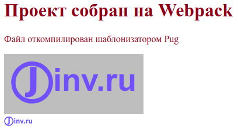
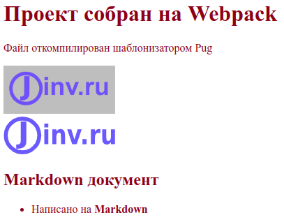

## О чем статья

В статье максимально подробно описывается настройка проекта на сборщике Webpack. Здесь мы узнаем, как установить и настроить Webpack и необходимые модули, которые позволят нам создавать фронтенд сайта используя удобные инструменты:

- шаблонизатор Pug для разметки, которая будет автоматически преобразовываться в разметку HTML
- препроцессор Sass для стилей, которые будут автоматически преобразовываться в стили CSS
- язык JavaScript для создания интерактивности сайта, при этом, можно будет использовать самые последние достижения языка и не переживать, что какая-то новая функция не будет распознана старым браузером
- разметка Markdown для наполнения содержимого страниц сайта. Разметка Markdown, в конечном итоге, будет автоматически преобразована в понятный для браузеров HTML

Освоив необходимый минимум можно без труда доработать созданный шаблон для работы с React или Vue

## Полезные ресурсы для настройки webpack

Когда мы будем настраивать вебпак, мы постоянно будем редактировать файл `webpack.config.js`. Поэтому, нелишнем будет держать под рукой справочник по опциям данного файла. Наиболее удобный в использовании справочник приведен на официальном сайте вебпака. Это [интерактивный файл конфигурации](https://webpack.js.org/configuration/#options), в котором можно нажать на название любой опции и перейти к подробной документации.

Можно воспользоваться очень удобным сервисом [createapp.dev](https://createapp.dev/), с помощью которого можно создать готовый шаблон проекта со всеми необходимыми настройками. Этот сервис позволяет настроить проект под Webpack, Parcel и Snowpack. Но это полезно в том случае, если вы имеете опыт и знания по данному вопросу. Если же вы впервые столкнулись с настройкой вебпака или не совсем хорошо понимаете тему, то лучше прочитать данную статью и собрать проект самостоятельно выполняя все рекомендации в статье.

## Быстрый запуск Webpack

Чтобы выполнять дальнейшие действия, на компьютере должен быть установлен [Node.js](https://nodejs.org/) и любой редактор кода, а также нужен браузер.

Все дальнейшие действия выполнялись в ОС Ubuntu 20.04, в которой был установлен NodeJS v16.17.1 и NPM v8.15.0, использовался стандартный Терминал и стандартный Текстовый редактор.

Откроем терминал и создадим каталог будущего проекта, и сразу перейдем в него:

```
mkdir my-project
cd my-project
```

Теперь, если нам нужна [система контроля версий Git](https://git-scm.com/), то выполним два простых шага, сначала, инициализируем Git:

```
git init
```

Будет создан скрытый каталог `.git`, в котором будут хранится все необходимые файлы git-репозитория. Чтобы увидеть его в файловом браузере нужно нажать комбинацию клавиш `Ctrl+H`.

Затем, в корне проекта создадим скрытый файл `.gitignore`:

```
touch .gitignore
```

В этом файле будем указывать имена и шаблоны для игнорируемых файлов и каталогов, которые не должны попадать в коммиты. Откроем данный файл с помощью редактора кода и запишем в нем следующее:

```
node_modules
```

Данная запись означает для Git - игнорировать каталог `node_modules`, не отслеживать и не добавлять его в репозиторий.

С настройками Git в этом проекте покончено. Теперь не забываем, иногда, а лучше, почаще, делать коммиты.

Теперь, инициализируем npm, для этого в терминале введем команду:

```
npm init -y
```

В корне проекта будет автоматически создан файл `package.json` с настройками по умолчанию (этому способствовала опция `-y`). Наиболее полную информацию о файле package.json можно прочитать в [документации по npm](https://docs.npmjs.com/cli/v8/configuring-npm/package-json).

Теперь установим `webpack`, а также `webpack-cli`, который используется для запуска webpack в командной строке. Для этого, в открытом терминале введем следующее:

```
npm i -D webpack webpack-cli
```

Опция `-D` указывает, что устанавливаемые пакеты нужны только для разработки и не будут использоваться в производственной сборке. Это будет зафиксировано в файле `package.json` в секции `"devDependencies": {...}`.

В результате выполнения вышеприведенной команды будет создан каталог `node_modules` и файл `package-lock.json`. Каталог `node_modules` содержит все установленные зависимости проекта. Обычно этот каталог не рекомендуется включать в репозитории, что мы и сделали, проигнорировав его в файле `.gitignore`. Файл `package-lock.json` хранит записи о точных версиях установленных зависимостей.

Создадим с помощью открытого терминала каталог `src`:

```
mkdir src
```

Каталог `src` будет создан в корне проекта. В нем будет хранится весь исходный код. Первым файлом в каталоге `src` создадим файл `index.js` со следующим кодом:

```js
function component(text) {
  const element = document.createElement('h1');
  element.textContent = text;
  return element;
}

document.body.append(component('Проект собран на Webpack'));
```

Далее, в редакторе кода откроем `package.json` и добавим в поле `"scripts"` строку кода, помеченную внизу знаком плюс `+`, плюс не добавляем:

```json
"scripts": {
+ "dev": "webpack --mode development",
  "test": "echo \"Error: no test specified\" && exit 1"
}
```

`dev` - это произвольное сокращенное имя для команды `webpack --mode development`. Все подобные именованные команды в секции `"scripts"` файла `package.json` запускаются в Node.js с помощью команды `npm run`. Так, для запуска вышеуказанной команды, введем в терминале следующее:

```
npm run dev
```

В результате, в корне проекта появится каталог `dist`, а в нем скомпилированный файл `main.js`. Если мы сравним содержимое данного файла с исходным `index.js`, то увидим отличия.

Команда `npm run build` в данном случае выполнит webpack в режиме разработки. Перед началом выполнения вебпак будет искать в корне проекта файл `webpack.config.js` с настройками. Но так как, мы его не создали, то будут применены настройки по умолчанию. Webpack определит точку входа в каталоге `src`, это файл `index.js`, и выведет откомпилированный код в `dist/main.js` (точка выхода). Чтобы изменить настройки по умолчанию смотри [Настройка в webpack точки входа и выхода](#настройка-в-webpack-точки-входа-и-выхода), однако, мы до этого шага дойдем постепенно.

Теперь создадим HTML файл, который будет загружать скрипт `main.js`. Для этого, в каталоге `dist` создадим файл `index.html` со следующим содержимым:

```html
<!DOCTYPE html>
<html>
  <head>
    <meta charset="utf-8" />
    <title>Быстрый запуск Webpack</title>
  </head>
  <body>
    <p>Данный файл создан вручную</p>
    <script src="main.js"></script>
  </body>
</html>
```

На данный момент файловая структура нашего проекта будет выглядеть так:

```
my-project
  |-dist
    index.html
    main.js
  |+node_modules
  |-src
    index.js
  package-lock.json
  package.json
```

Если теперь мы откроем в браузере файл `dist/index.html`, то увидим следующее:

```
Проект собран на Webpack
Данный файл создан вручную
```

## Установка и настройка html-webpack-plugin

Недостаток предыдущего метода очевиден, приходится вручную "допиливать" готовую сборку, чтобы она заработала в браузере. Поэтому, настроим вебпак, чтобы HTML-файл автоматически создавался в готовой сборке из исходного шаблона. Для этого используем html-webpack-plugin.

Установим плагин:

```
npm i -D html-webpack-plugin
```

Теперь настроим html-webpack-plugin. Для этого создадим в корне проекта файл `webpack.config.js` и заполним его следующим содержимым.

```js
const HtmlWebpackPlugin = require('html-webpack-plugin');
const path = require('path');

module.exports = {
  plugins: [
    new HtmlWebpackPlugin({
      template: path.join(__dirname, 'src', 'template.html'),
      filename: 'index.html',
    }),
  ],
};
```

Файл настроек [webpack.config.js](https://webpack.js.org/configuration/#options) нужен вебпаку для того, чтобы он знал, какие плагины и с какими настройками использовать в том или ином случае. Если файл настроек находится в корне проекта и имеет имя `webpack.config.js`, то его не нужно нигде прописывать, вебпак автоматически находит его. Если же необходимо сменить расположение файла или его имя, то файл настроек нужно указать с помощью опции `--config` в файле `package.json`:

```json
"scripts": {
  "serve": "webpack serve --open --mode development --config serve.config.js"
}
```

Пояснение к содержимому нашего файла `webpack.config.js`:

- Первые две строки импортируют модули `html-webpack-plugin` и `path`, определяя их в переменные `HtmlWebpackPlugin` и `path` соответственно.

- `module.exports = {}` - это объект, который экспортируется как модуль по умолчанию.

- Для плагина `html-webpack-plugin` создается экземпляр `new HtmlWebpackPlugin` с двумя заданными свойствами: `template` - путь к входному файлу и `filename` - имя выходного файла.

Разберем путь, указанный в свойстве `template`, который, на первый взгляд, сложен для понимания.

В Linux и macOS пути выглядят так: `/path/to/template.html`. В Windows пути имеют другой вид: `C:\path\to\template.html`. Чтобы учитывать эти различия в Node.js имеется модуль `path`. Мы его подключили во второй строке файла `webpack.config.js`, а затем вызвали в свойстве `template`. Есть метод [path.join](https://nodejs.org/dist/latest-v16.x/docs/api/path.html#pathjoinpaths), который объединяет все заданные сегменты пути вместе и использует необходимый разделитель для конкретной системы. Сегменты пути для метода `path.join` мы задали тремя аргументами `__dirname`, `'src'` и `'template.html'`. В Linux системе мы могли бы вместо такого кода `template: path.join(__dirname, 'src', 'template.html')` указать проще - `template: './src/template.html'`

- `__dirname` - это глобальная константа, которая указывает абсолютный путь к каталогу файла, код которого запрашивает эту константу, т. е. в нашем случае, этим файлом является `webpack.config.js`, а `__dirname` содержит абсолютный путь к корневому каталогу проекта.

Вместо метода `path.join` часто применяют метод [path.resolve](https://nodejs.org/dist/latest-v16.x/docs/api/path.html#pathresolvepaths).

В каталоге `src` создадим входной файл `template.html` с такой разметкой:

```html
<!DOCTYPE html>
<html>
  <head>
    <meta charset="utf-8" />
    <title>Быстрый запуск Webpack</title>
  </head>
  <body>
    <p>Данный файл создан плагином html-webpack-plugin</p>
  </body>
</html>
```

Теперь удалим каталог `dist` с двумя содержащимися в нем файлами. Откроем терминал в корне проекта и запустим команду:

```
npm run dev
```

Мы увидим, что каталог `dist` снова создан, а внутри него находятся файлы `index.html` и `main.js`. Если мы откроем в браузере файл `dist/index.html`, то увидим:

```
Проект собран на Webpack
Данный файл создан плагином html-webpack-plugin
```

Таким образом, с помощью плагина html-webpack-plugin из исходного файла `src/template.html` создан файл `dist/index.html`, в котором подключен скрипт `dist/main.js`, а он, в свою очередь, создан из `src/index.js`.

Теперь, мы можем разрабатывать свой проект придерживаясь следующих шагов:

1. Редактируем исходный код в любом из файлов каталога `src`
2. Сохраняем результат
3. Выполняем сборку проекта:

```
npm run dev
```

4. Открываем в браузере файл `dist/index.html`, либо если этот файл уже открыт, перезагружаем страницу браузера.
5. Смотрим на полученный результат в браузере и если нас что-то не устраивает повторяем все пункты сначала.

## Установка и настройка DevServer

В нашем проекте есть лишние действия, при редактировании кода, чтобы увидеть результат, нужно каждый раз запускать в терминале команду `npm run dev` и вручную обновлять страницу браузера. Это очень быстро надоедает. Для уменьшения количества рутинных операций, автоматизируем процесс.

В webpack доступно три способа, которые могут автоматически компилировать код всякий раз, когда вы его сохраняете:

1. [Режим Watch](https://webpack.js.org/guides/development/#using-watch-mode)
2. [webpack-dev-server](https://webpack.js.org/guides/development/#using-webpack-dev-server)
3. [webpack-dev-middleware](https://webpack.js.org/guides/development/#using-webpack-dev-middleware)

Здесь рассмотрим вариант с веб сервером. Установим webpack-dev-server:

```
npm i -D webpack-dev-server
```

Откроем файл `webpack.config.js` и добавим настройки для веб сервера:

```js
const HtmlWebpackPlugin = require('html-webpack-plugin');
const path = require('path');

module.exports = {
  plugins: [
    new HtmlWebpackPlugin({
      template: path.join(__dirname, 'src', 'template.html'),
      filename: 'index.html',
    }),
  ],
  devServer: {
    watchFiles: path.join(__dirname, 'src'),
    port: 9000,
  },
};
```

Для `devServer` указаны два свойства:

- `watchFiles` указывает на каталог `src`, за которыми будет вестись наблюдение и в случае, если в нем произойдут изменения, веб сервер будет автоматически пересобирать проект и перезагружать страницу браузера.
- `port` указывает порт на котором будет работать веб-сервер (по умолчанию - localhost:8080).

Чтобы запускать веб сервер короткой командой создадим для CLI скрипт "serve" в файле `package.json`:

```json
{
  "scripts": {
+   "serve": "webpack serve --open --mode development",
    "dev": "webpack --mode development",
    "test": "echo \"Error: no test specified\" && exit 1"
  }
}
```

`serve` означает запустить веб сервер. [`--open`](https://webpack.js.org/configuration/dev-server/#devserveropen) автоматически запускает браузер по умолчанию. `--mode development` включает режим разработки.

Перед тем как запустить веб сервер удалим каталог `dist`. Это делать необязательно, а нужно для того, чтобы понять работу веб-сервера.

Запустим веб сервер командой:

```
npm run serve
```

В результате будет открыта страница браузера по адресу http://localhost:9000/ и мы увидим тоже самое, что и в прошлый раз:

```
Проект собран на Webpack
Данный файл создан плагином html-webpack-plugin
```

Но, если мы посмотрим на файловую структуру проекта, то не увидим, каталога `dist`. Тогда откуда браузер берет данные для вывода?

Нужно понимать, что webpack-dev-server компилирует исходный код, и записывает все файлы в оперативную память.

Теперь файловая структура нашего проекта будет выглядеть так:

```
my-project
  |-node_modules
  |-src
    index.js
    template.html
  package-lock.json
  package.json
  webpack.config.js
```

Чтобы остановить веб сервер нужно в терминале, нажать сочетание клавиш Ctrl+C.

## Настройка в Webpack точки входа и выхода

Начиная с четвертой версии, Webpack позволяет не задавать точки входа и выхода, а использовать настройки по умолчанию: точка входа - `./src/index.js` и точка выхода - `./dest/main.js`. Однако, это удобно, когда ваш проект очень простой. При попытке расширить функциональность, без настроек точек входа и выхода не обойтись.

### Точка входа

**Точка входа** - это файл, который вебпак начнет компилировать первым и если в этом файле будут подключены какие-нибудь зависимости, то все они тоже будут обработаны.

Укажем в настройках, использовать точку входа. Для этого в файл `webpack.config.js` добавим свойство `entry`:

```js
module.exports = {
  entry: path.join(__dirname, 'src', 'index.js'),
};
```

Теперь, если нам нужно будет изменить точку входа мы изменяем значение свойства `entry`. Также, можно задать несколько точек входа. Это бывает нужно при [разделении большого кода](https://webpack.js.org/guides/code-splitting/) на части. Более подробно о настройках точки входа можно прочитать в статьях [Entry Points](https://webpack.js.org/concepts/entry-points/) и [Entry and Context](https://webpack.js.org/configuration/entry-context/).

### Точка выхода

**Точка выхода** - это каталог, в который вебпак скомпилирует все точки входа.

Чтобы настроить точку выхода, нужно в файл `webpack.config.js` добавить свойство `output`:

```js
module.exports = {
  output: {
    path: path.join(__dirname, 'dist'),
    filename: 'index.[contenthash].js',
  },
};
```

где:

- `[contenthash]` - это шаблон, в который подставляется хеш, сгенерированный на основе контента данного файла. Хеширование делает имя уникальными после каждого изменения содержимого файла. Это решает проблему версионирования. Если хеш изменился, то браузер берет не старый файл из кеша, а загружает новый с сервера. Если вы считаете, что 20 знаков хеша слишком много, то вы можете отрезать от него нужное количество символов следующим образом [contenthash:8]. Хеш будет иметь длину 8 символов. Более подробно о шаблоне хешей можно прочить в статье [Hash vs chunkhash vs ContentHash](https://medium.com/@sahilkkrazy/hash-vs-chunkhash-vs-contenthash-e94d38a32208).

Более полная информация о точках выхода приведена в статьях [concepts/output](https://webpack.js.org/concepts/output/) и [configuration/output](https://webpack.js.org/configuration/output/).

Теперь файл `webpack.config.js` должен выглядеть так:

```js
const HtmlWebpackPlugin = require('html-webpack-plugin');
const path = require('path');

module.exports = {
  entry: path.join(__dirname, 'src', 'index.js'),
  output: {
    path: path.join(__dirname, 'dist'),
    filename: 'index.[contenthash].js',
  },
  plugins: [
    new HtmlWebpackPlugin({
      template: path.join(__dirname, 'src', 'template.html'),
      filename: 'index.html',
    }),
  ],
  devServer: {
    watchFiles: path.join(__dirname, 'src'),
    port: 9000,
  },
};
```

Запустим из терминала следующую команду:

```
npm run dev
```

В корне проекта появится каталог `dist`, в котором будут находиться два файла: `index.html` и `index.d0b265b1468ab7c3a3c1.js`. Мы видим что, файл `main.js` теперь называется `index.d0b265b1468ab7c3a3c1.js`. Код в имени файла - это хеш, который будет меняться с изменением содержимого файла.

## Автоматическая очистка каталога dist

Перед каждым запуском вебпака полезно очищать от содержимого каталог dist. Это предотвратит накапливание в нем файлов со старыми версиями. Для этого можно применить [filemanager-webpack-plugin](https://github.com/gregnb/filemanager-webpack-plugin).

Для начала, установим его:

```
npm i -D filemanager-webpack-plugin
```

Затем, в файле webpack.config.js настроим:

```js
  const HtmlWebpackPlugin = require('html-webpack-plugin');
  const path = require('path');
+ const FileManagerPlugin = require('filemanager-webpack-plugin');

  module.exports = {
    plugins: [
      new HtmlWebpackPlugin({
        ...
      }),
+     new FileManagerPlugin({
+       events: {
+         onStart: {
+           delete: ['dist'],
+         },
+       },
+     }),
    ],
    devServer: {
      ...
    },
  };
```

Если быть точным, то будет производится не очистка, а полное удаление каталога `dist`.
Плагин `filemanager-webpack-plugin` может также копировать, создавать, перемещать, архивировать файлы и каталоги не только перед началом сборки `onStart`, но и по окончании `onEnd`. В дальнейшем, мы воспользуемся плагином для копирования файлов.

## Настройка режима production и создание производственной сборки

До сих пор мы работали с вебпаком в режиме разработки. Но чтобы получить готовое приложение, которое можно разместить на удаленном сервере, нужно создать производственную сборку.

Откроем файл `package.json` и добавим скрипт `"build"`:

```json
  "scripts": {
    "serve": "webpack serve --open --mode development",
    "dev": "webpack --mode development",
+   "build": "webpack --mode production",
    "test": "echo \"Error: no test specified\" && exit 1"
  },
```

Прежде чем выполнить нижеприведенную команду, откроем файл `dist/index.6ab939774fe4ecf4a2d6.js` в редакторе кода и посмотрим на него. Мы увидим кучу различных комментариев, а код представлен в не сжатом виде. Если мы посмотрим на размер файла, то он составит, примерно, 1424 байта.

Запустим в терминале вебпак в режиме продакшн:

```
npm run build
```

После этого, посмотрим на содержимое файла `dist/index.js`, в котором увидим отсутствие комментариев и сжатый код. Размер самого файла составит 139 байт. Это основное отличие режима продакшн от режима разработки - код конечного бандла сжимается. То же относится и к файлу `index.html`, который в режиме разработки не сжимается и его размер составляет 273 байта, а в продакшн режиме убираются все пробелы и ненужные символы и размер файла становится равен 250 байт.

## Babel

Большинство новых браузеров поддерживают все новые возможности JavaScript ES6-ES13. Но, многие из этих возможностей не поддерживаются старыми браузерами, которые до сих пор используются в мире. Поэтому, если для вас важно сохранять поддержку этих браузеров, то самым распространенным способом является применение [Babel](https://babeljs.io/). Babel - это компилятор, который позволяет применять неподдерживаемые версии JavaScript в устаревших браузерах.

> Чтобы посмотреть, какие браузеры поддерживают ту или иную функцию можно воспользоваться сервисом [Can I use](https://caniuse.com/). Если в строке `Can I use______?` ввести `es13`, то будет выведен список функций, которые ожидаются в 13-ом выпуске ECMAScript. При выборе любой из этих функций, будет показана таблица, в которой указаны браузеры и их версии, поддерживающие и не поддерживающие эту функцию.

Babel позволяет писать код с использованием новых возможностей JavaScript ES6-ES13. При этом мы можем не заботится о том, что какая-то функция не будет поддерживаться каким-либо браузером. Babel транспилирует весь JavaScript код в ES5, а браузеры, которые не поддерживают этот стандарт уже практически никем не используются. Для работы самого Babel нужно установить два пакета `@babel/core` и `@babel/preset-env`, а чтобы Babel мог работать с Webpack нужно установить загрузчик `babel-loader`. Установим все три пакета одной командой:

```
npm i -D @babel/core @babel/preset-env babel-loader
```

Все конфиги для Babel можно указывать в файле `.babelrc`. Создадим этот файл в корне проекта:

```
touch .babelrc
```

Откроем его и внесем следующий код:

```json
{
  "presets": [
    [
      "@babel/preset-env",
      {
        "modules": false
      }
    ]
  ]
}
```

Теперь, откроем файл `webpack.config.js` и добавим настройки для Babel:

```js
module.exports = {
  ...
  module: {
    rules: [
      {
        test: /\.js$/,
        use: 'babel-loader',
        exclude: /node_modules/,
      },
    ],
  },
};
```

Здесь мы видим объект `module`, для которого задано правило `rules`. Для вебпака любой файл является модулем, будь то скрипт, файл стилей, шрифта или изображения.

## Подключение шаблонизатора Pug

Верстка на чистом HTML не совсем удобна при написания разметки и поддержки больших проектов. Придуманы более удобные инструменты, которые называются шаблонизаторами.

Шаблонизаторы позволяют:

- создавать шаблоны, компоненты, блоки
- работать с данными, подставляя эти данные в код. Так, имея компонент для карточки товара, и подставляя данные в этот компонент из объекта JSON, шаблонизатор может автоматически создать огромное количество карточек. Также, меняя данные можно менять классы, что позволяет управлять интерфейсом компонентов.
- задавать условные выражения и циклы, как в языках программирования.

Одним из таких инструментов является [шаблонизатор Pug](https://pugjs.org/). Он написан на JavaScript и выполняется в среде Node.js. Шаблонизатор Pug имеет свой синтаксис, на котором пишется разметка. Этот синтаксис основан на отступах и отличается от синтаксиса HTML отсутствием угловых скобок и закрывающихся тегов. После компиляции синтаксис Pug превращается в HTML код.

Webpack имеет плагин и загрузчик файлов [pug-loader](https://www.npmjs.com/package/pug-loader) для шаблонизатора Pug.

> Загрузчик pug-loader не поддерживает Pug 3-ей версии. Если для кого-то это принципиально важно, то предлагаю два варианта решения:
>
> - Сравнительно недавно появился [pug-plugin](https://www.npmjs.com/package/pug-plugin), который работает с Webpack 5 и Pug 3. Но для его работы нужно существенно изменить общепринятые настройки, так как он заменяет многие плагины для вебпак.
> - Самостоятельно сделать поддержку плагином pug-loader третьей версии Pug, и дождаться, пока разработчики данного плагина сами это сделают. Это мой способ, о нем можно прочитать с статье [XXXXXX](XXXXXXXXXXXXXXXXXXXXXXXXXXXXXXXXXXXXXXX)

Установим pug и pug-loader

```
npm i -D pug pug-loader
```

Вебпаку в его конфиг файле укажем, что мы используем плагин `pug-plugin` для файлов с расширением `.pug`:

```js
const HtmlWebpackPlugin = require('html-webpack-plugin');
const path = require('path');

module.exports = {
  entry: path.join(__dirname, 'src', 'index.js'),
  output: {
    path: path.join(__dirname, 'dist'),
    filename: 'index.[contenthash].js',
  },
  plugins: [
    new HtmlWebpackPlugin({
+     template: path.join(__dirname, 'src', 'index.pug'),
      filename: 'index.html',
    }),
  ],
  devServer: {
    watchFiles: path.join(__dirname, 'src'),
    port: 9000,
  },
  module: {
    rules: [
      {
        test: /\.js$/,
        use: 'babel-loader',
        exclude: /node_modules/,
      },
+     {
+       test: /\.pug$/,
+       loader: 'pug-loader',
+     },
    ],
  },
};
```

Создадим файл `./src/index.pug` и напишем в нем следующее:

```pug
html
  head
    meta(charset='utf-8')
    title= 'Быстрый запуск Webpack'
  body
    p Данный файл откомпилирован шаблонизатором Pug
```

Файл `src/template.html` теперь можно удалить.

Запустим в терминале команду:

```
npm run serve
```

Будет открыта страница браузера по адресу http://localhost:9000/ и мы увидим:

```
Проект собран на Webpack
Данный файл откомпилирован шаблонизатором Pug
```

## Загрузка стилей

Для написания стилей мы будем использовать препроцессор [Sass](https://sass-lang.com/dart-sass), который расширяет возможности CSS и упрощает создание CSS-кода. В конечном итоге, стили, написанные на SCSS будут преобразованы препроцессором в CSS. А чтобы большинство браузеров понимало самые современные возможности CSS, мы будем прогонять этот CSS через постпроцессор PostCSS.

Установим необходимые пакеты:

```
npm i -D sass-loader postcss-loader postcss-preset-env css-loader style-loader sass
```

где:

- [sass-loader](https://www.npmjs.com/package/sass-loader) - загрузчик файлов Sass/SCSS
- [sass](https://www.npmjs.com/package/sass) компилятор файлов `.scss` в `.css`.
- [postcss-loader](https://www.npmjs.com/package/postcss-loader) - загрузчик CSS файлов для пост-обработки. Должен работать с каким нибудь плагином.
- [postcss-preset-env](https://www.npmjs.com/package/postcss-preset-env) - плагин для PostCSS, который конвертирует современный CSS в код, понятный большинству браузеров, включением необходимых полифилов.
- [css-loader](https://www.npmjs.com/package/css-loader) загрузчик CSS-файлов
- [style-loader](https://webpack.js.org/loaders/style-loader/) загрузчик стилей в DOM

> Если вы собираетесь использовать только CSS и не пользоваться преимуществами SCSS и PostCSS, то можно установить только `css-loader` и `style-loader`.

Создадим файл `src/main.scss` и внесем в него следующее:

```scss
$font-size: 1rem;
$font-color: lch(28 99 35);

html {
  font-size: $font-size;
  color: $font-color;
}
```

В файле используются переменные Sass, а также [LCH цвета](https://habr.com/ru/company/ruvds/blog/496966/), которые поддерживаются не всеми браузерами, но используя PostCSS эти цвета будут транспилированы в понятные любому браузеру цвета.

Импортируем этот файл в `src/index.js`:

```js
import './main.scss';
```

Такой импорт стилей в скрипт не поддерживается языком JavaScript, а возможен благодаря webpack.

Настроим пакеты в `webpack.config.js`:

```js
const HtmlWebpackPlugin = require('html-webpack-plugin');
const path = require('path');

module.exports = {
  entry: path.join(__dirname, 'src', 'index.js'),
  output: {
    path: path.join(__dirname, 'dist'),
    filename: 'index.[contenthash].js',
  },
  plugins: [
    new HtmlWebpackPlugin({
      template: path.join(__dirname, 'src', 'index.pug'),
      filename: 'index.html',
    }),
  ],
  devServer: {
    watchFiles: path.join(__dirname, 'src'),
    port: 9000,
  },
    module: {
    rules: [
      {
        test: /\.js$/,
        use: 'babel-loader',
        exclude: /node_modules/,
      },
      {
        test: /\.pug$/,
        loader: 'pug-loader',
      },
+     {
+       test: /\.(scss|css)$/,
+       use: ['style-loader', 'css-loader', 'postcss-loader', 'sass-loader'],
+     },
    ],
  },
};
```

Указываем вебпаку, какие загрузчики стилей применять. Причем, порядок их перечисления в массиве важен, так как загрузчики используются вебпаком от последнего к первому:

- Так что последним в списке должен быть sass-loader, который загружает файлы SCSS и компилирует его в CSS.

- Затем идет postcss-loader, который с помощью [PostCSS](https://postcss.org/) транспилирует самые современные фичи CSS (переменные, миксины и многое другое) в то, что понятно большинству браузеров. Также, PostCSS применяет автопрефиксер и линтер к CSS.

- Следующим в списке будет css-loader, который интерпретирует @import и url() внутри CSS.

- Последним является style-loader, который внедряет CSS в DOM

Настройки для PostCSS можно задать как в файле `webpack.config.js` так и в собственном файле настроек `postcss.config.js`. Мы воспользуемся вторым способом, создадим файл `postcss.config.js` и запишем в нем следующее:

```js
module.exports = {
  plugins: {
    'postcss-preset-env': {
      browsers: 'last 2 versions',
    },
  },
};
```

Запустим в терминале команду:

```
npm run serve
```

Откроется браузер и мы увидим окрашенный в цвет текст.

```
Проект собран на Webpack
Данный файл откомпилирован шаблонизатором Pug
```

Теперь остановим сервер сочетанием клавиш Ctrl+C и введем в терминале команду:

```
npm run build
```

Если мы заглянем в каталог `dist`, то не обнаружим файла с расширением `.css`. Это связано с тем, что стили находятся в бандле `index.[contenthash].js`. Мы можем извлечь стили в отдельный файл, что позволит раздельно кэшировать JS и CSS, для этого применим плагин [mini-css-extract-plugin](https://github.com/webpack-contrib/mini-css-extract-plugin). Он создает CSS-файл из каждого JS-файла, в котором содержится CSS. Сначала установим `mini-css-extract-plugin`:

```
npm i -D mini-css-extract-plugin
```

Затем настроим его в файле `webpack.config.js`:

```js
const MiniCssExtractPlugin = require('mini-css-extract-plugin');

module.exports = {
  plugins: [
    new MiniCssExtractPlugin({
      filename: '[name].[contenthash].css',
    }),
  ],
  module: {
    rules: [
      {
        test: /\.(scss|css)$/,
        use: [
          MiniCssExtractPlugin.loader,
          'css-loader',
          'postcss-loader',
          'sass-loader',
        ],
      },
    ],
  },
};
```

Вместо `'style-loader'` используем `MiniCssExtractPlugin.loader`.

## Загрузка изображений

Здесь мы настроим webpack для работы с изображениями в формате PNG, JPG, GIF и SVG.
Начиная с webpack 5, вместо загрузчиков изображений, значков, шрифтов и т. д. используется встроенный [Asset Modules](https://webpack.js.org/guides/asset-modules/). До webpack 5 было принято использовать [raw-loader](https://v4.webpack.js.org/loaders/raw-loader/), [url-loader](https://v4.webpack.js.org/loaders/url-loader/) и [file-loader](https://v4.webpack.js.org/loaders/file-loader/).

Для поддержки изображений устанавливать ничего не нужно, а лишь требуется настроить `webpack.config.js`:

```js
const HtmlWebpackPlugin = require('html-webpack-plugin');
const path = require('path');

module.exports = {
  entry: path.join(__dirname, 'src', 'index.js'),
  output: {
    path: path.join(__dirname, 'dist'),
    filename: 'index.[contenthash].js',
+   assetModuleFilename: path.join('images', '[name].[contenthash][ext]'),
  },
  plugins: [
    new HtmlWebpackPlugin({
      template: path.join(__dirname, 'src', 'index.pug'),
      filename: 'index.html',
    }),
  ],
  devServer: {
    watchFiles: path.join(__dirname, 'src'),
    port: 9000,
  },
  module: {
    rules: [
      {
        test: /\.js$/,
        use: 'babel-loader',
        exclude: /node_modules/,
      },
      {
        test: /\.pug$/,
        loader: 'pug-loader',
      },
      {
        test: /\.(scss|css)$/,
        use: ['style-loader', 'css-loader', 'postcss-loader', 'sass-loader'],
      },
+     {
+       test: /\.(png|jpg|jpeg|gif)$/i,
+       type: 'asset/resource',
+     },
+     {
+       test: /\.svg$/,
+       type: 'asset/resource',
+       generator: {
+         filename: path.join('icons', '[name].[contenthash][ext]'),
+       },
+     },
    ],
  },
};
```

- `assetModuleFilename` - позволяет указать выходной каталог и шаблон имен файлов, для всех модулей, которые соответствуют правилу `type: 'asset/resource'`. Если assetModuleFilename не указан, то, по умолчанию, каталогом будет `dist`, а имя файла будет `[contenthash][ext]`.

- `[ext]` - шаблон расширения файла.

- `generator.filename` - позволяет переопределить `assetModuleFilename` для конкретного asset-правила. В данном случае, svg-файлы будут выводиться в каталог `dist/icons`

- `type` имеет четыре типа asset:

  - `asset/resource` - работает так же, как и загрузчик [file-loader](https://github.com/webpack-contrib/file-loader), а именно, все модули, которые соответствуют правилу `type: 'asset/resource'` будут выводится в указанный с помощью `assetModuleFilename` каталог.

  - `asset/inline` работает как загрузчик [url-loader](https://v4.webpack.js.org/loaders/url-loader/). Все модули, соответствующие правилу `type: 'asset/inline'`, будут встроены в код бандла как [Data URL](https://developer.mozilla.org/ru/docs/Web/HTTP/Basics_of_HTTP/Data_URLs).

  - `asset/source` похож на работу загрузчика [raw-loader](https://github.com/webpack-contrib/raw-loader). Все модули, соответствующие правилу `type: 'asset/source'`, будут встроены без каких-либо преобразований (как есть).

  - `asset` объединяет `asset/resource` и `asset/inline`. Он работает следующим образом: если размер модуля больше 8 КБ, то он работает как `asset/resource`, в противном случае - как `asset/inline`. Размер 8 КБ задан по умолчанию, но его можно изменить с помощью свойства [parser.dataUrlCondition.maxSize](https://webpack.js.org/guides/asset-modules/#general-asset-type).

Создадим каталог `src/images` и поместим в него любое изображение с именем `image.png`

Откроем ранее созданный файл `src/index.pug` и допишем в него строку с тегом `img`:

```pug
doctype html
html(lang= 'ru')
  head
    meta(charset='utf-8')
    title= 'Быстрый запуск Webpack'
  body
    p Данный файл откомпилирован шаблонизатором Pug
    .logo-png
      img.logo1(src=require('./images/image.png') alt='Загрузка PNG изображений с помощью Webpack')
    .logo-svg
      img.logo2(src=require('./images/logo.svg'), alt='Загрузка SVG изображений с помощью Webpack')
```

В атрибуте `src` используется `require`, т. е. мы запрашиваем изображение как модуль.

Запустим в терминале команду:

```
npm run serve
```

В окне браузера мы увидим, что на нашей странице появилось два рисунка:



Мы можем изменить размер изображения через стили. Для этого откроем файл `src/main.scss` и зададим размеры для обоих изображений:

```scss
.logo1 {
  width: 10em;
}

.logo2 {
  width: 10em;
}
```

Сохраним изменения и увидим, что размер изображений стал одинаковым. При этом, мы изменили только ширину, а высота изменилась пропорционально.

## Оптимизация изображений

Многие изображения могут быть сжаты без заметного ухудшения качества, что даст выигрыш в скорости загрузки приложения. Для этого придуманы инструменты оптимизации изображений.

Векторные изображения, к которым относится формат SVG, можно неограниченно масштабировать без потери качества. SVG - это текстовый язык разметки, а SVG-файлы можно редактировать при помощи обычных текстовых редакторов. Если в SVG изображении не сильно много мелких деталей, то SVG-файлы обычно получаются меньше по размеру, чем сравнимые по качеству изображения в форматах JPEG или GIF, а также SVG-файлы хорошо поддаются сжатию. SVG широко применяется во фронтенде и для него придумано много инструментов. Одним из таких инструментов является минификатор [svgo](https://github.com/svg/svgo), который удаляет лишний код в разметке и тем самым уменьшает размер файла SVG.

Установим svgo:

```
npm i -D svgo
```

Теперь, чтобы заработало сжатие для SVG файлов, мы настроим совместную работу svgo и imagemin с помощью плагина [imagemin-svgo](https://github.com/imagemin/imagemin-svgo).

Для оптимизации растровых изображений широко применяется минификатор [imagemin](https://github.com/imagemin/imagemin). Для webpack существует [ImageMinimizerWebpackPlugin](https://webpack.js.org/plugins/image-minimizer-webpack-plugin/#optimize-with-imagemin) - это загрузчик и плагин для оптимизации изображений с помощью imagemin.

Сначала, установим плагин `image-minimizer-webpack-plugin` и минификатор `imagemin`:

```
npm i -D image-minimizer-webpack-plugin imagemin
```

Затем, для оптимизации изображений без потерь качества, установим следующие рекомендуемые плагины:

```
npm i -D imagemin-gifsicle imagemin-jpegtran imagemin-optipng imagemin-svgo
```

В файл `webpack.config.js` добавим настройки:

```js
const ImageMinimizerPlugin = require('image-minimizer-webpack-plugin');

module.exports = {
  module: {
    rules: [
      ...
    ],
  },
  optimization: {
    minimizer: [
      new ImageMinimizerPlugin({
        minimizer: {
          implementation: ImageMinimizerPlugin.imageminMinify,
          options: {
            plugins: [
              ['gifsicle', { interlaced: true }],
              ['jpegtran', { progressive: true }],
              ['optipng', { optimizationLevel: 5 }],
              ['svgo', { name: 'preset-default' }],
            ],
          },
        },
      }),
    ],
  },
};
```

Для `svgo` параметры оптимизации установлены по умолчанию `{ name: 'preset-default' }`. Более подробно о настройках оптимизации `svgo` можно узнать [здесь](https://github.com/svg/svgo).

Запустим команду

```
npm run build
```

Сравним размеры файлов изображений в каталоге `src` и `dist`. Файл `image.png` был 4,9 КБ, а стал 2,3 КБ, файл `logo.svg` был 11,4 КБ, а стал 2,5 КБ. Мы видим, заметное сжатие изображений.

## Включение синтаксиса Markdown и файлов .md в Pug

Чтобы использовать Markdown в шаблонизаторе Pug, можно применить фильтр `:markdown-it` модуля [jstransformer-markdown-it](https://github.com/jstransformers/jstransformer-markdown-it).

[Фильтры](https://pugjs.org/language/filters.html) позволяют использовать в шаблонизаторе Pug многие другие языки. Для начала установим модуль `jstransformer-markdown-it`:

```
npm i -D jstransformer-markdown-it
```

Теперь мы можем в Pug файле использовать синтаксис Markdown:

```pug
doctype html
html(lang= 'ru')
  head
    meta(charset='utf-8')
    title= 'Быстрый запуск Webpack'
  body
    p Данный файл откомпилирован шаблонизатором Pug
    img(src=require('./images/image.png') alt='Загрузка изображений с помощью Webpack')

    :markdown-it(linkify langPrefix='highlight-')
      ## Markdown документ

      - Написано на **Markdown**
```



либо поместить markdown разметку в файл `.md` и включить этот файл в шаблон, используя `include`:

```pug
include:markdown-it article.md
```

## Копирование файлов и каталогов с помощью Webpack

Часто возникает необходимость скопировать в готовую сборку некоторые файлы или каталоги без их преобразования. Это могут быть какие-либо документы в формате PDF, либо файл robots.txt, который используется для ограничения доступа поисковым роботам к определенным ресурсам сайта, и т.п.

В параграфе [Автоматическая очистка каталога dist](#автоматическая-очистка-каталога-dist) мы применяли плагин `filemanager-webpack-plugin`, который может удалять, копировать, создавать, перемещать и архивировать файлы и каталоги, как перед началом сборки, так и по ее окончании. Так как плагин в проекте уже установлен, то остается настроить его для копирования.

```js
* const FileManagerPlugin = require('filemanager-webpack-plugin');

  module.exports = {
    plugins: [
      ...,
*     new FileManagerPlugin({
*       events: {
*         onStart: {
*           delete: ['dist'],
*         },
+         onEnd: {
+           copy: [
+             {
+               source: path.join('src', 'static', 'robots.txt'),
+               destination: path.join('dist', 'robots.txt'),
+             },
+             {
+               source: '/src/static/docs/*.pdf',
+               destination: '/dist/docs/'
+             },
+           ],
*         },
*       },
*     }),
      ...,
    ],
  };
```

Звездочками отмечены строки, относящиеся к данному плагину и настроенные в прошлом, а знаком `+` строки, которые мы добавили сейчас.

==============================================================================
Вышеприведенные способы хороши, если нам нужно конкретную статью markdown вставить в конкретный шаблон. Однако, часто бывает такая ситуация, что имеются несколько markdown статей и они могут быть расположены в различных каталогах, т. е. разделены по темам. При этом, каждая отдельная статья может находиться в отдельном каталоге, так как в этой статье присутствуют изображения и логично будет держать их в одном каталоге со статьей. Создавать для каждой статьи свой шаблон нерационально. Поэтому, нужен инструмент, который должен автоматически обходить все каталоги, и, найденные файлы `.md`, помещать в указанный шаблон pug и сразу генерировать страницу html.

//=============================
//
//=============================

## Другие плагины

- **mini-css-extract-plugin** - этот плагин извлекает CSS в отдельные файлы. Он создает файл CSS для каждого файла JS, который содержит CSS.

//=========================================================
где:

- `[name]` - это шаблонная [подстановка](https://webpack.js.org/configuration/output/#outputfilename) имени. В данном случае она равна имени `index` из имени файла точки входа. Так как точек входа может быть несколько, то `[name]` позволяет сохранить свое уникальное имя для каждого файла.

Используемые источники:

- [Webpack DOCUMENTATION](https://webpack.js.org/concepts/)
- [Webpack 5 - Asset Modules](https://dev.to/smelukov/webpack-5-asset-modules-2o3h)
